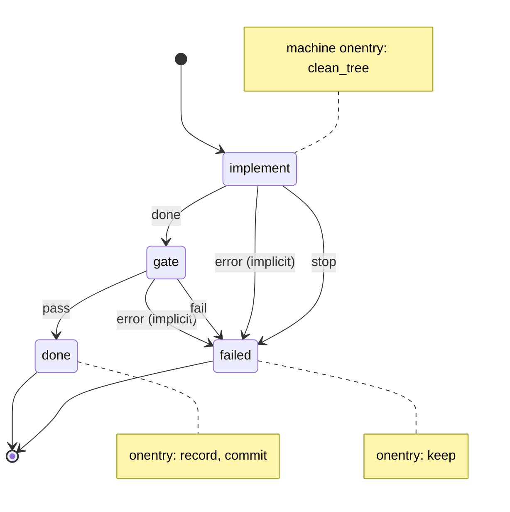

# develop

Make the repo match a message with Claude, then run the repo's pre-push gate.

Machine: [machines/develop.yml](../machines/develop.yml)

```mermaid
stateDiagram-v2
    [*] --> implement
    gate --> failed: error (implicit)
    gate --> failed: fail
    gate --> done: pass
    implement --> gate: done
    implement --> failed: error (implicit)
    implement --> failed: stop
    done --> [*]
    failed --> [*]
    note left of implement
        machine onentry: clean_tree
    end note
    note right of done
        onentry: record, commit
    end note
    note right of failed
        onentry: keep
    end note
```
