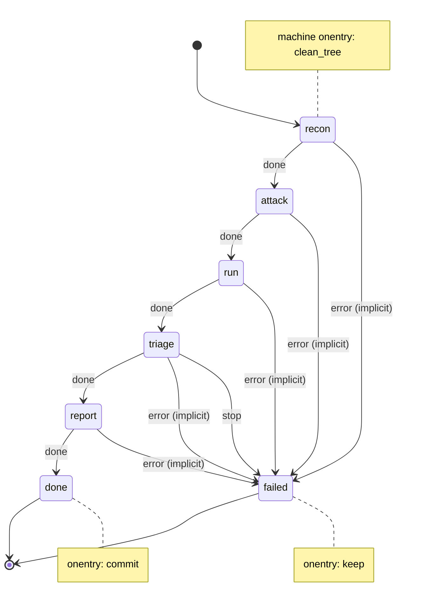

# qa

Attack the project to make it misbehave, and hand each real bug to develop as a failing test; Claude writes tests only and never fixes code.

Machine: [machines/qa.yml](../machines/qa.yml)

```mermaid
stateDiagram-v2
    [*] --> recon
    attack --> run: done
    attack --> failed: error (implicit)
    recon --> attack: done
    recon --> failed: error (implicit)
    report --> done: done
    report --> failed: error (implicit)
    run --> triage: done
    run --> failed: error (implicit)
    triage --> report: done
    triage --> failed: error (implicit)
    triage --> failed: stop
    done --> [*]
    failed --> [*]
    note left of recon
        machine onentry: clean_tree
    end note
    note right of done
        onentry: commit
    end note
    note right of failed
        onentry: keep
    end note
```
