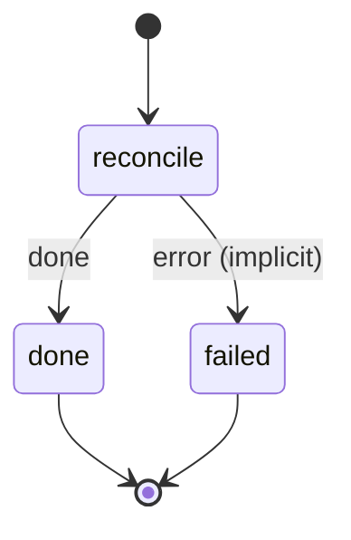

# reconcile

Re-run, through develop, every processed migration that changed since it last landed.

Machine: [machines/reconcile.yml](../machines/reconcile.yml)

```mermaid
stateDiagram-v2
    [*] --> reconcile
    reconcile --> done: done
    reconcile --> failed: error (implicit)
    done --> [*]
    failed --> [*]
```
