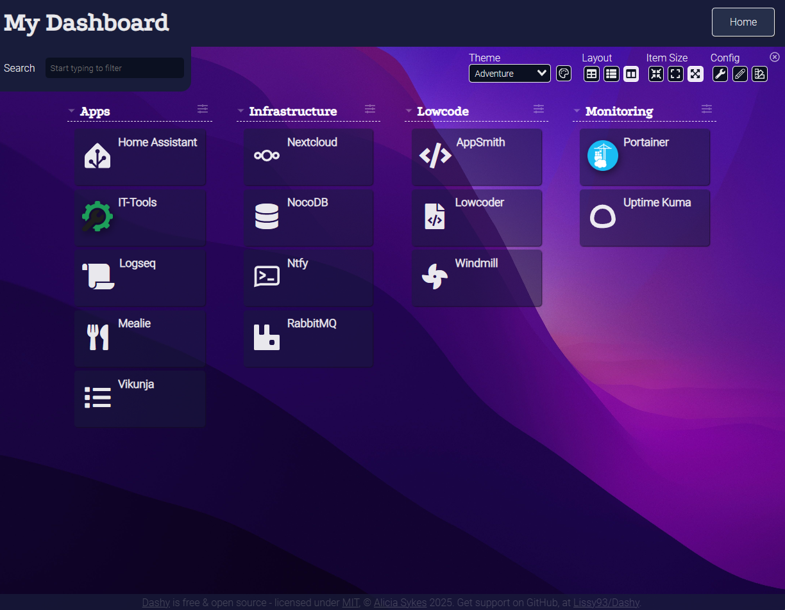

# Existential
Be present and EXIST. Unlock potential and free time with free software. Built for individuals seeking an edge against the onslaught of tasks and ideas before them—those willing to put in (or delegate) significant effort to make it happen. This is a collection of vetted solutions, stitched together to create something greater.
If it exists; don't remake it—bridle it.

### Dashboard (courtesy of [dashy](https://opensource.org/license/mit))

### Architecture diagram

## Alternatives
- [Tana](https://tana.inc/)

## [Hosting](/hosting/README.md)

## Getting started
#### Prerequisites
##### Docker
https://www.docker.com/

##### An S3 compatible API like MinIO for file triggers
See [/hosting/README.md](/hosting/README.md)

#### Setup
- Copy .env.example files and fill in your values `cp .env.example .env`
- Setup the docker network
- `docker network create exist --subnet=172.18.0.0/24`

#### Run
- `docker-compose up -d` in each service directory you want to run.
OR
- Coming soon `./deployStack.sh` to deploy each service marked in main .env

## Applications
### Monitoring/managing containers
- [Dashy](./services/dashy/README.md)
- [Portainer](./hosting/portainer/README.md)
- [Uptime-Kuma](./hosting/uptimeKuma/README.md)

### File editing [alts](./graveyard/fileEditor.md)
- [OnlyOffice](https://www.onlyoffice.com/download-desktop.aspx#desktop)

### Note taking [alts](./graveyard/notes.md)
- [Logseq](./services/logseq/README.md)

### When/notification/task management [alts](./graveyard/when.md)
- [ntfy](./services/ntfy/README.md)

### Low code database/spreadsheets [alts](./graveyard/lowcodeDB.md)
- [NocoDB](./services/nocoDB/README.md)

### Low code UI website editor [alts](./graveyard/lowcodeUI.md)
- [Appsmith](./services/appsmith/README.md) for "internal" apps (more functional)
- [Lowcoder](./services/lowcoder/README.md) for "external" apps (prettier)

### Workflow [alts](./graveyard/lowcodeWorkflow.md)
- [Windmill](./services/windmill/README.md)

### Random tools [alts](./graveyard/tools.md)
- [IT-Tools](./services/itTools/README.md)

### Personal finance
- Firefly-III https://github.com/firefly-iii/firefly-iii (TBD)

### Recipe management
- [Mealie](./services/mealie/README.md)

### Coming soon
[AI](./graveyard/ai.md)

## Third-Party Software

This project includes multiple open source projects with respective licensing.

#### Appsmith
- Source: https://github.com/appsmithorg/appsmith
- License: [Apache2](https://www.apache.org/licenses/LICENSE-2.0)

#### Dashy
- Source: https://github.com/Lissy93/dashy
- License: [MIT](https://opensource.org/license/mit)

#### IT Tools
- Source: https://github.com/CorentinTh/it-tools
- License: [GPL-3](https://www.gnu.org/licenses/gpl-3.0.html)

#### Logseq
- Source: https://github.com/logseq/logseq
- License: [AGPL-3](https://www.gnu.org/licenses/agpl-3.0.html)

#### Lowcoder
- Source: https://github.com/lowcoder-org/lowcoder
- License: [AGPL-3](https://www.gnu.org/licenses/agpl-3.0.html)

#### NocoDB
- Source: https://github.com/nocodb/nocodb
- License: [AGPL-3](https://www.gnu.org/licenses/agpl-3.0.html)

#### Vikunja
- Source: https://github.com/go-vikunja/
- License: [AGPL-3](https://www.gnu.org/licenses/agpl-3.0.html)

#### Windmill
- Source: https://github.com/windmill-labs/windmill
- License: [AGPL-3](https://www.gnu.org/licenses/agpl-3.0.html) + other unused licenses
