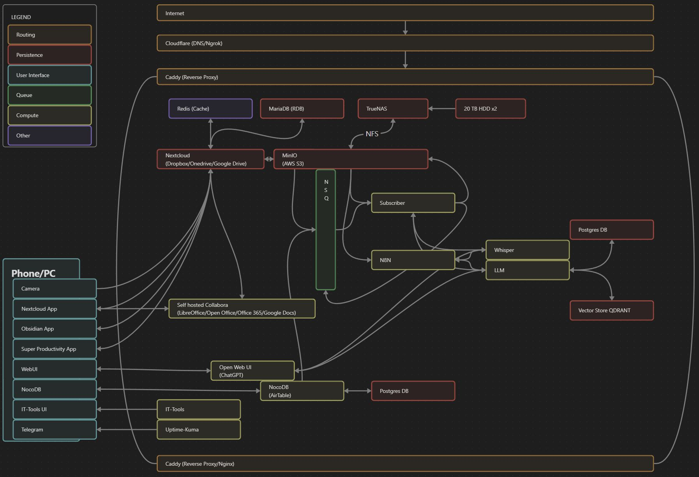

# existential
Personal knowledge management, and automations.

## Journey to PKM and automation
### File system
- [Proxmox](./Proxmox/README.md) (alt: Unraid)
- [TrueNAS](./TrueNAS/README.md)

### File system abstraction (alt: AWS S3)
- [MinIO](./MinIO/README.md)

### File sharing (alt: Dropbox/Onedrive/Google Drive)
- [Redis](./Redis/README.md) (cache for Nextcloud)
- [Nextcloud](./Nextcloud/README.md)

### External hosting AKA reverse-proxy
- [Caddy](./Caddy/README.md) (alt: Nginx)
- [Cloudflare](./Cloudflare/README.md) (alt: any domain manager/DNS/[Ngrok](./Ngrok/README.md))

### File editing (alt: LibreOffice/Open Office/Office 365/Google Docs)
- [Collabora](./Collabora/README.md)

### Note taking (alt: OneNote/Evernote/Notion)
- [Obsidian](./Obsidian/README.md)

### Optional tools
- [Tasks: Super Productivity](./Tasks/README.md)
- [IT-Tools](./IT-Tools/README.md)
- [Uptime-Kuma](./Uptime-Kuma/README.md)
- [NocoDB](./NocoDB/README.md)
- [Fabric](./Fabric/README.md)

### PubSub (alt: RabbitMQ/Kafka)
- [NSQ](./NSQ/README.md)

### AI
- [Ollama](./Ollama/README.md) (alt: OpenAI)
- [Whisper](./Whisper/README.md) (alt: OpenAI)
- [Speaches](./Speaches/README.md)
- [OpenWebUI](./OpenWebUI/README.md) (alt: ChatGPT)

### Automation workflow options
- [Flowise](./Flowise/README.md)
- [N8N](./N8N/README.md)

## Using
### Prerequisites
#### Docker
https://www.docker.com/

### Setup
- Copy .env.example files and fill in your values `cp .env.example .env`
- Setup the docker network
- `docker network create exist --subnet=172.18.0.0/24`

#### Recommended server administrator method
Remote SSH using VSCode.
- Using Remote Explorer VSCode plugin
- Add new connection
- Enter the address of the server
- Save the configuration to user config (or whatever)
- Enter password
- Open directory: wherever you want to clone this repo

### Running
Run a service:
- In the directory for the service you would like to run
- Run the command `docker-compose up -d`

Services are separated in different docker-compose.yml files to make it easier to split up the workload across servers.
