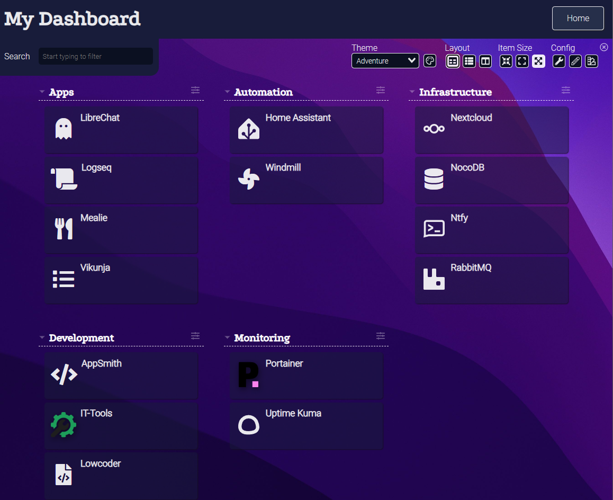
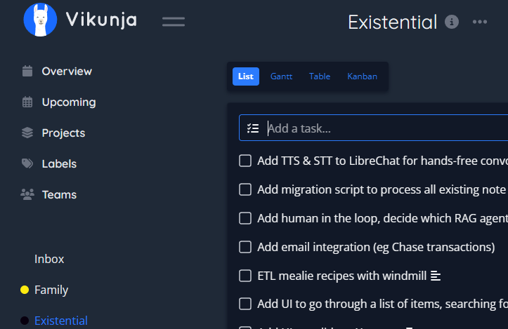
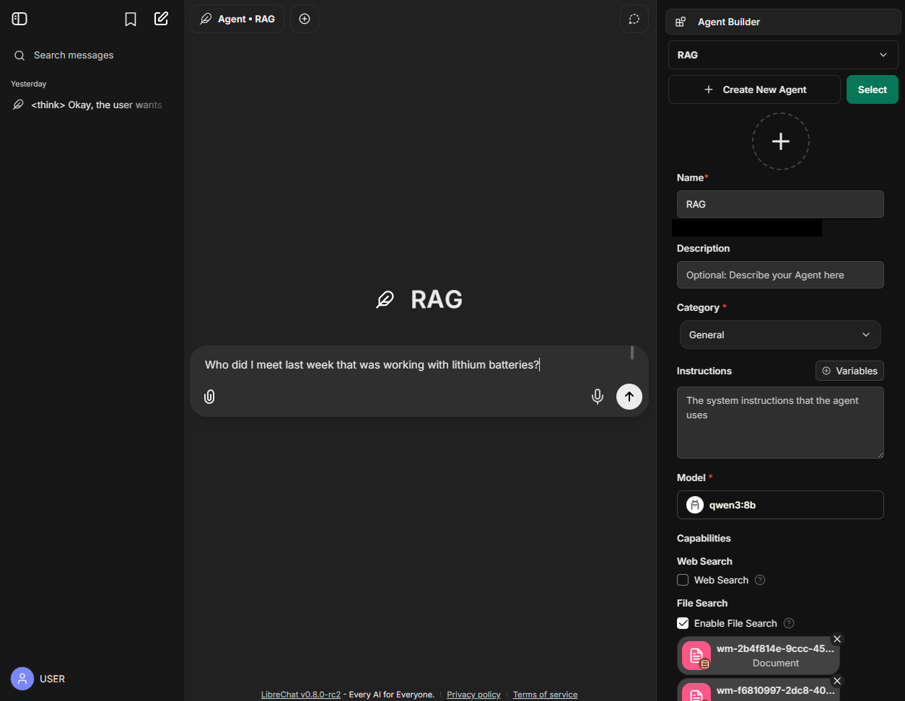
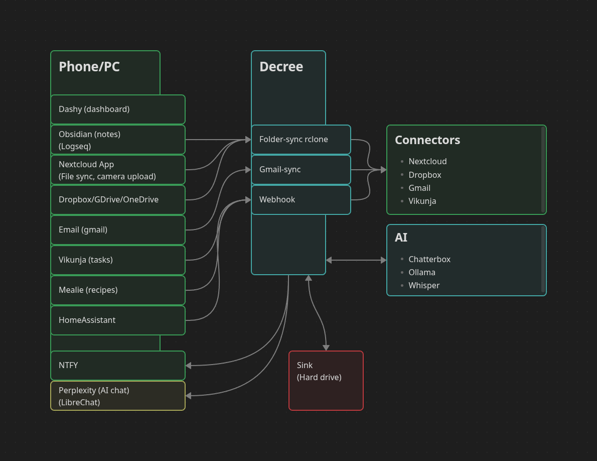

# Existential

Personal productivity suite targeting self-actualization. Remember everything, plan anything, empathize with yourself, simplify and automate tasks. The core of Existential is the individual. A collection of free open source software for AI tools, workflow automation, note-taking, file management, and various productivity applications, all of which can be used commercially, in case you want to run a business.

## 🚀 Quick Start

Get your entire Existential environment configured in one command:

```bash
./existential.sh
```

## 📊 Dashboard
### (courtesy of [dashy](https://opensource.org/license/mit))


## Examples
### Meeting

###### [More detailed diagram](./automations/flows/transcribe/transcription.png)
- Record a meeting (phone or desktop)
- Get notified with the transciption and summary
- Add tasks in Vikunja
##### 

### Recall

- Chat with your notes using [LibreChat](./ai/libreChat/README.md)

## Applications
### AI
- [LibreChat](./ai/libreChat/README.md) (interface with RAG: all notes/digital context)
- TODO: add [firecrawl](https://github.com/firecrawl/firecrawl?tab=readme-ov-file) for web search
- [Ollama](./ai/ollama/README.md) (general AI)
- [Whisper](./ai//whisper/README.md) (TODO transcription)

### Workflow automation [alts](./graveyard/lowcodeWorkflow.md)
- [Windmill](./services/windmill/README.md)

### Note taking [alts](./graveyard/notes.md)
- [Logseq](./services/logseq/README.md)
- Nightlio https://github.com/shirsakm/nightlio (TBD)

### Recipe management
- [Mealie](./services/mealie/README.md)

### Personal finance
- Firefly-III https://github.com/firefly-iii/firefly-iii (TBD)

### File editing [alts](./graveyard/fileEditor.md)
- [OnlyOffice](https://www.onlyoffice.com/download-desktop.aspx#desktop)

### When (notification/task management) [alts](./graveyard/when.md)
- [ntfy](./services/ntfy/README.md)
- [Vikunja](./services/vikunja/README.md)

### Low code database/spreadsheets [alts](./graveyard/lowcodeDB.md)
- [NocoDB](./services/nocoDB/README.md)

### Low code UI website editor [alts](./graveyard/lowcodeUI.md)
- [Appsmith](./services/appsmith/README.md) for "internal" apps (more functional)
- [Lowcoder](./services/lowcoder/README.md) for "external" apps (prettier)

### Monitoring/managing containers
- [Dashy](./services/dashy/README.md) dashboard.
- [Portainer](./hosting/portainer/README.md) remote docker container management.
- [Uptime-Kuma](./hosting/uptimeKuma/README.md) notifications when servers go down.

### Random tools [alts](./graveyard/tools.md)
- [IT-Tools](./services/itTools/README.md)

## Architecture diagram


## Getting started
### Pre-requisite: Docker
https://www.docker.com/

### Networking
Existential automatically creates a Docker overlay network called `exist` with the following features:
- **Overlay driver**: Enables multi-host communication (Docker Swarm compatible)
- **Attachable**: Allows standalone containers to join the network
- **Encrypted**: IP-sec encryption between nodes for secure communication

The network is automatically created when you run `docker compose up` - no manual network creation required!

Individual services communicate with each other using container names (e.g., `librechat-api` can reach `librechat-mongodb:27017`).

### Run
- Run `./existential.sh`
- Follow the steps to configure defaults (see [dynamic variables](./automations/existential/README.md#dynamic-variables))
- See [Hosting](/hosting/README.md#enabledisable-services) to enable/disable services
- `docker compose up` to run all configured services

### Learn
[Hosting](/hosting/README.md)

## Third-Party Software

This project includes multiple open source projects with respective licensing.
