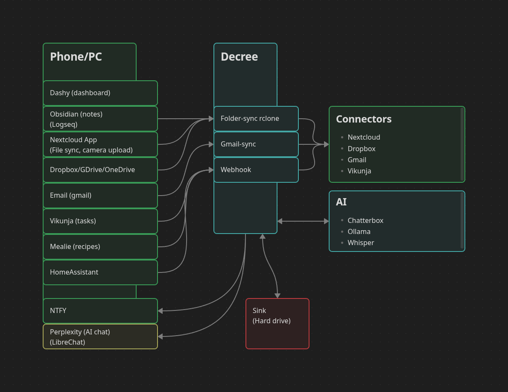
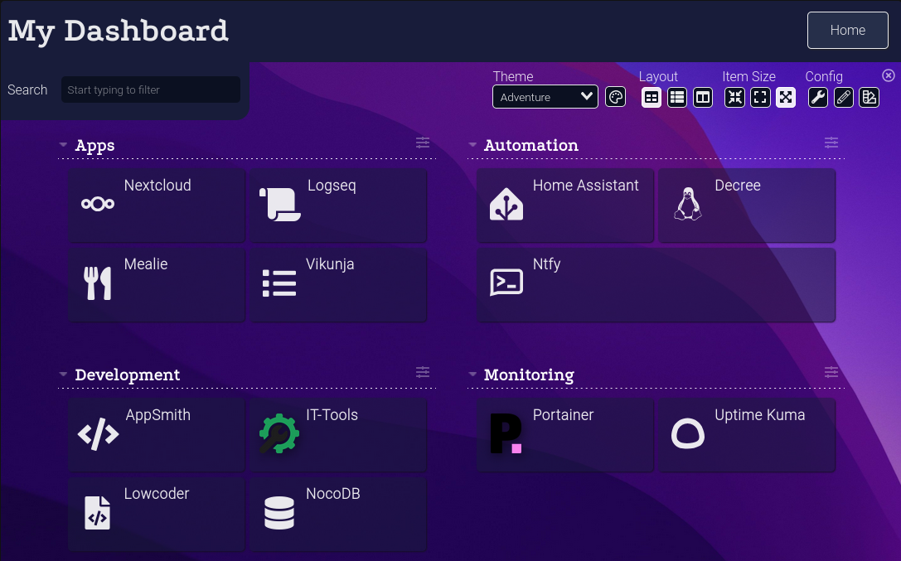
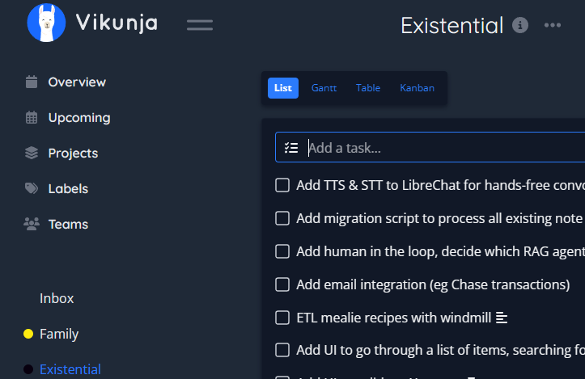

# Existential

Balance in technology, free open source software.


Take control of your digital footprint to turn knowledge and intention into reality.

## 🚀 Quick Start

Get your entire Existential environment configured in one command:

### Pre-requisite: [Docker](https://www.docker.com/get-started/)

```bash
./existential.sh
```

[Self Hosting Guide](https://existential.company/docs/hosting/)

## System design

Use existing apps like normal; perhaps switch to more friendly alternatives that allow data extraction. Push all your data into a single sink. With all your data available, create routines to automate tasks, leverage AI, and get notified only when necessary. Use more technology so you can see less technology.



## 📊 Dashboard



## Applications

### Interactive

- Perplexity (paid enterprise) [FOSS alts](https://existential.company/docs/graveyard/ai/)
- [ActualBudget](https://existential.company/docs/services/actual-budget) Budget
- [Immich](https://existential.company/docs/services/immich) Images and Videos
- [Logseq](https://existential.company/docs/services/logseq) Notes [alts](https://existential.company/docs/graveyard/notes/)
- [Mealie](https://existential.company/docs/services/mealie) Recipes / meal planning
- [Ntfy](https://existential.company/docs/services/ntfy) Notifications
- [OnlyOffice](https://www.onlyoffice.com/download-desktop.aspx#desktop) PDF/word editor [alts](https://existential.company/docs/graveyard/file-editors/)
- [Vikunja](https://existential.company/docs/services/vikunja) Tasks

#### Advanced custom interfaces

- [Decree](https://existential.company/docs/decree/decree) automation [alts](https://existential.company/docs/graveyard/automation/)
- [NocoDB](https://existential.company/docs/services/nocodb) Database [alts](https://existential.company/docs/graveyard/automation/appsmith)
- [Lowcoder](https://existential.company/docs/graveyard/automation/lowcoder)

### Background services

- [Ollama](https://existential.company/docs/ai/ollama) (general AI)
- [Chatterbox](https://existential.company/docs/ai/chatterbox) (TTS)
- [Whisper](https://existential.company/docs/ai/whisper) (STT transcription)

### Monitoring/managing containers

- [Dashy](https://existential.company/docs/services/dashy) dashboard.
- [Portainer](https://existential.company/docs/hosting/portainer) remote docker container management.
- [Uptime-Kuma](https://existential.company/docs/hosting/uptime-kuma) notifications when servers go down.

### Random tools [alts](https://existential.company/docs/graveyard/tools/)

- [IT-Tools](https://existential.company/docs/services/it-tools)

## Examples

### Meeting


- Record a meeting (phone or desktop)
- Get notified with the transciption and summary
- Add tasks in Vikunja

##### 

## Third-Party Software

This project includes multiple open source projects with respective licensing.
