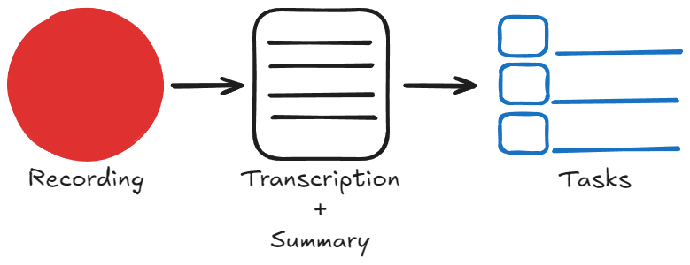

# Existential

Balance in technology, free open source software.


Take control of your digital footprint to turn knowledge and intention into reality.

## 🚀 Quick Start

Get your entire Existential environment configured in one command:

### Pre-requisite: [Docker](https://www.docker.com/get-started/)

```bash
./existential.sh
```

[Self Hosting Guide](/hosting/README.md)

## System design

Use existing apps like normal; perhaps switch to more friendly alternatives that allow data extraction. Push all your data into a single sink. With all your data available, create routines to automate tasks, leverage AI, and get notified only when necessary. Use more technology so you can see less technology.


## 📊 Dashboard ([dashy](https://opensource.org/license/mit))


## Applications

### Interactive

- Perplexity (paid enterprise) [FOSS alts](./graveyard/ai.md)
- [ActualBudget](./services/actualBudget/README.md) Budget
- [Immich](./services/immich/README.md) Images and Videos
- [Logseq](./services/logseq/README.md) Notes [alts](./graveyard/notes.md)
- [Mealie](./services/mealie/README.md) Recipes / meal planning
- [Ntfy](./services/ntfy/README.md) Notifications
- [OnlyOffice](https://www.onlyoffice.com/download-desktop.aspx#desktop) PDF/word editor [alts](./graveyard/fileEditor.md)
- [Vikunja](./services/vikunja/README.md) Tasks

#### Advanced custom interfaces

- [Decree](./services/decree/README.md) automation [alts](./graveyard/lowcodeWorkflow.md)
- [NocoDB](./services/nocoDB/README.md) Database [alts](./graveyard/lowcodeDB.md)
- [Lowcode](./graveyard/lowcodeUI.md)

### Background services

- [Ollama](./ai/ollama/README.md) (general AI)
- [Chatterbox](./ai//chatterbox/README.md) (TTS)
- [Whisper](./ai//whisper/README.md) (STT transcription)

### Monitoring/managing containers

- [Dashy](./services/dashy/README.md) dashboard.
- [Portainer](./hosting/portainer/README.md) remote docker container management.
- [Uptime-Kuma](./hosting/uptimeKuma/README.md) notifications when servers go down.

### Random tools [alts](./graveyard/tools.md)

- [IT-Tools](./services/itTools/README.md)

## Examples

### Meeting



###### [More detailed diagram](./automations/flows/transcribe/transcription.png)

- Record a meeting (phone or desktop)
- Get notified with the transciption and summary
- Add tasks in Vikunja

##### 

## Third-Party Software

This project includes multiple open source projects with respective licensing.
