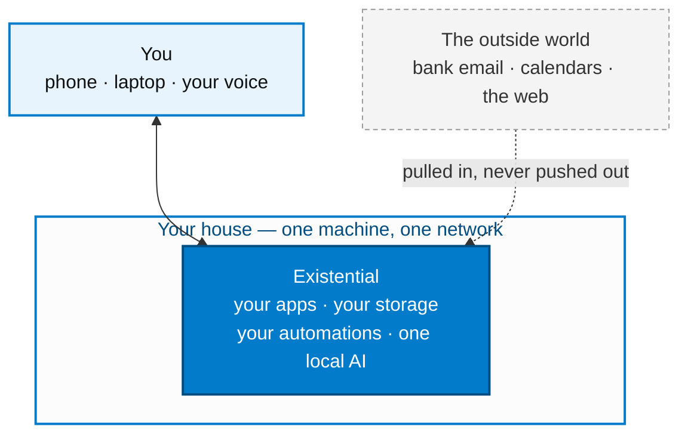
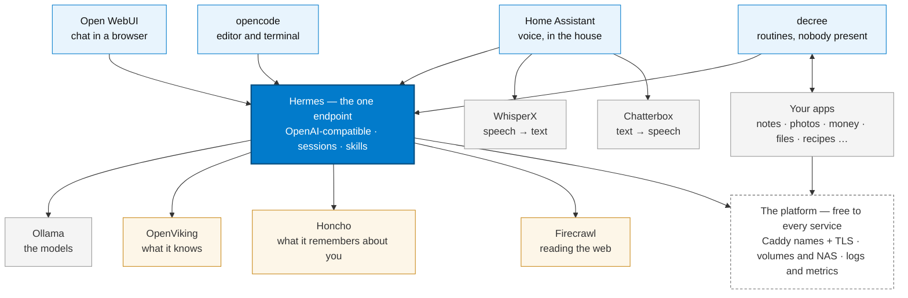

# Existential

**An active second brain, unsiloed.**

Open source already does everything you need — but every app keeps what it knows to itself.
Existential runs them as one system on your own hardware, with a local AI underneath that can
act on everything in it.


```mermaid
flowchart TB
    you["You<br/>phone · laptop · your voice"]
    outside["The outside world<br/>bank email · calendars · the web"]

    subgraph house["Your house — one machine, one network"]
        ex["Existential<br/>your apps · your storage<br/>your automations · one local AI"]
    end

    you <--> ex
    outside -. "pulled in, never pushed out" .-> ex

    classDef me fill:#e8f4fd,stroke:#027bcb,stroke-width:2px,color:#111
    classDef core fill:#027bcb,stroke:#014d80,stroke-width:2px,color:#fff
    classDef ext fill:#f4f4f4,stroke:#999,stroke-dasharray:4 3,color:#333
    class you me
    class ex core
    class outside ext
    style house fill:#fcfcfc,stroke:#027bcb,stroke-width:2px,color:#014d80
```

- **The software already exists.** A curated list, not an app store. Adding one is flipping a flag.
- **Figure it out once.** Hostnames, HTTPS, storage, logging, secrets, backups — solved a single
  time and applied to everything. The fortieth service costs the same as the second.
- **Nothing leaves the house.** Your files are on your disks, your models on your GPU. Unplug the
  internet and it keeps working.

## 🚀 Quick start

Prerequisite: [Docker](https://www.docker.com/get-started/)

```bash
git clone https://github.com/jtmckay/existential.git
cd existential

./existential.sh quest      # pick your services
docker compose up -d
```

`./existential.sh` renders each enabled service's templates and merges them into one
`docker-compose.yml` and one `.env` at the repo root. Always run compose from the root, never
from a service folder.

📖 **[Getting Started](https://existential.company/docs/getting-started)** for the full walkthrough.

## How it fits together

Everything reaches the AI the same way — voice, browser, editor and automation all hit one
OpenAI-compatible endpoint, so the model, key, skills and memory are configured once instead of
four times.


```mermaid
flowchart TB
    ha["Home Assistant<br/>voice, in the house"]
    owui["Open WebUI<br/>chat in a browser"]
    oc["opencode<br/>editor and terminal"]
    dec["decree<br/>routines, nobody present"]

    hermes["Hermes — the one endpoint<br/>OpenAI-compatible · sessions · skills"]
    ollama["Ollama<br/>the models"]
    stt["WhisperX<br/>speech → text"]
    tts["Chatterbox<br/>text → speech"]

    viking["OpenViking<br/>what it knows"]
    honcho["Honcho<br/>what it remembers about you"]
    craw["Firecrawl<br/>reading the web"]

    apps["Your apps<br/>notes · photos · money · files · recipes …"]
    platform["The platform — free to every service<br/>Caddy names + TLS · volumes and NAS · logs and metrics"]

    ha --> hermes
    owui --> hermes
    oc --> hermes
    dec --> hermes
    ha --> stt
    ha --> tts
    hermes --> ollama
    hermes --> viking
    hermes --> honcho
    hermes --> craw
    dec <--> apps
    hermes --> platform
    apps --> platform

    classDef surface fill:#e8f4fd,stroke:#027bcb,color:#111
    classDef gateway fill:#027bcb,stroke:#014d80,stroke-width:2px,color:#fff
    classDef model fill:#f4f4f4,stroke:#999,color:#333
    classDef base fill:#fff,stroke:#666,stroke-dasharray:4 3,color:#333
    classDef reach fill:#fdf6e8,stroke:#c98a1b,color:#333
    class ha,owui,oc,dec surface
    class hermes gateway
    class ollama,stt,tts,apps model
    class viking,honcho,craw reach
    class platform base
```

Every service is a folder. Its flag — `EXIST_IS_<CATEGORY>_<SLUG>` — is derived from the path,
so **adding a service is adding a folder**. Disabled services are skipped entirely: no
templates render, no secrets are generated, nothing lands on disk.

📖 **[The Pieces](https://existential.company/docs/how-it-works)** for the whole model.

## What's in it

### AI

| | |
|---|---|
| [Hermes](https://existential.company/docs/ai/hermes) | Agent gateway — one OpenAI-compatible endpoint for every surface |
| [Ollama](https://existential.company/docs/ai/ollama) | Local models |
| [Open WebUI](https://existential.company/docs/ai/open-web-ui) | Day-to-day chat |
| [WhisperX](https://existential.company/docs/ai/whisperx) | Speech → text, with speaker diarization |
| [Chatterbox](https://existential.company/docs/ai/chatterbox) | Text → speech |
| [OpenViking](https://existential.company/docs/ai/openviking) | Context database — memory, resources, skills |
| [Honcho](https://existential.company/docs/ai/honcho) | Cross-session memory |
| [Firecrawl](https://existential.company/docs/ai/firecrawl) | Web scraping API for agents |
| [ComfyUI](https://existential.company/docs/ai/comfyui) | Image and video generation |
| [MCP](https://existential.company/docs/ai/mcp) | Tool servers for agents |

### Your stuff

| | |
|---|---|
| [Actual Budget](https://existential.company/docs/services/actual-budget) | Budgeting |
| [Immich](https://existential.company/docs/services/immich) | Photos and video |
| [Obsidian](https://existential.company/docs/services/obsidian) | Notes and tasks (desktop app, plain files) |
| [Mealie](https://existential.company/docs/services/mealie) | Recipes and meal planning |
| [Home Assistant](https://existential.company/docs/services/homeassistant) | Home automation and voice |
| [Ntfy](https://existential.company/docs/services/ntfy) | Notifications |

### Storage

| | |
|---|---|
| [Nextcloud](https://existential.company/docs/storage/nextcloud) | File sync and sharing |
| [MinIO](https://existential.company/docs/storage/minio) | S3-compatible object storage |
| [Collabora](https://existential.company/docs/storage/collabora) | Document editing in the browser |
| [Redis](https://existential.company/docs/storage/redis) | Nextcloud cache |

### Build your own

| | |
|---|---|
| [Decree](https://existential.company/docs/decree/) | The automation engine — routines, cron, webhooks |
| [NocoDB](https://existential.company/docs/services/nocodb) | Database as a spreadsheet |
| [Appsmith](https://existential.company/docs/services/appsmith) | Internal tool builder |
| [Lowcoder](https://existential.company/docs/services/lowcoder) | Customer-facing app builder |
| [code-server](https://existential.company/docs/services/code-server) | VS Code in the browser |
| [IT-Tools](https://existential.company/docs/services/it-tools) | Developer odds and ends |

### Hosting and monitoring

| | |
|---|---|
| [Caddy](https://existential.company/docs/hosting/caddy) | Hostnames and TLS for everything |
| [pi-hole](https://existential.company/docs/hosting/pihole) | LAN DNS and ad blocking |
| [Dashy](https://existential.company/docs/services/dashy) | One page linking to all of it |
| [Portainer](https://existential.company/docs/hosting/portainer) | Container management |
| [Grafana](https://existential.company/docs/hosting/grafana) · [Loki](https://existential.company/docs/hosting/loki) · [Prometheus](https://existential.company/docs/hosting/prometheus) | Dashboards, logs, metrics |
| [Uptime Kuma](https://existential.company/docs/hosting/uptime-kuma) | Notifications when something goes down |

Considered and rejected alternatives, with reasons, live in the
[graveyard](https://existential.company/docs/graveyard/).

## What it does with all that

A **flow** is one complete path from *something happened* to *it was handled*:

- [Note → Action](https://existential.company/docs/flows/note-to-action) — a thought worth chasing gets chased, and comes back with the right questions
- [Camera → OCR](https://existential.company/docs/flows/image-ocr) — photograph something, get back its text
- [Recording → Transcription](https://existential.company/docs/flows/recording-transcription) — recordings become searchable, speaker-labelled text
- [Bank Alert → Budget](https://existential.company/docs/flows/transaction-gmail-actual-budget) — transaction emails become budget entries

📖 **[All flows](https://existential.company/docs/flows/)**

## Docs

The documentation is layered like a [C4 diagram](https://c4model.com/) — each level zooms in one
step, and you can stop at any of them.

| | | |
|---|---|---|
| **Level 1** | [What It Is](https://existential.company/docs/intro) | What this is and what it does for you |
| **Level 2** | [The Pieces](https://existential.company/docs/how-it-works) | What's actually running and how it fits |
| **Level 3** | [Flows](https://existential.company/docs/flows/) | How one job gets done, start to finish |
| **Level 4** | [Build On It](https://existential.company/docs/build-on-it) | The contract to write against |

## Third-party software

This project runs multiple open source projects under their respective licenses. See
[Open Source Notices](https://existential.company/docs/open-source-notices) and the
[licensing audit](https://existential.company/docs/licensing).
