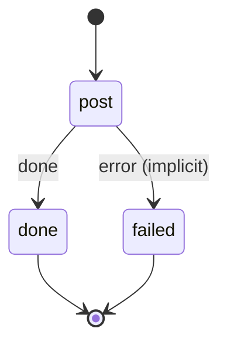

# actual_budget

Post one transaction to Actual Budget, the amount as the message body; tell Telegram when it is configured.

Machine: [machines/actual_budget.yml](../machines/actual_budget.yml)

```mermaid
stateDiagram-v2
    [*] --> post
    post --> done: done
    post --> failed: error (implicit)
    done --> [*]
    failed --> [*]
```
