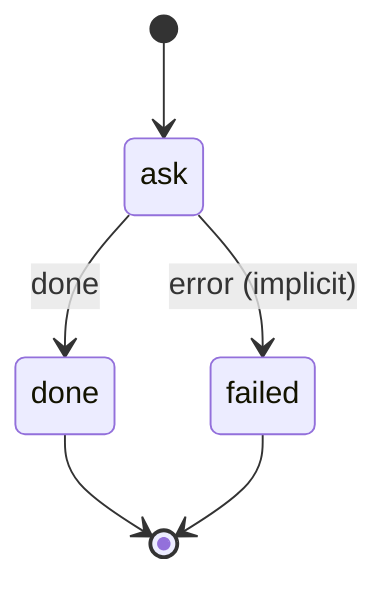

# agent_task

Hand a task to a hermes profile and file the answer in workspace/ai/, then notify.

Machine: [machines/agent_task.yml](../machines/agent_task.yml)

```mermaid
stateDiagram-v2
    [*] --> ask
    ask --> done: done
    ask --> failed: error (implicit)
    done --> [*]
    failed --> [*]
```
