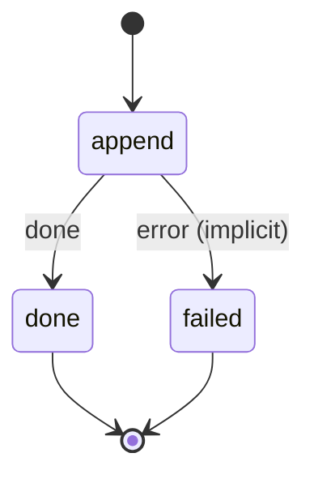

# capture

Append the message body (JSON {source, text} or plain text) to the capture stream, workspace/.capture/.

Machine: [machines/capture.yml](../machines/capture.yml)

```mermaid
stateDiagram-v2
    [*] --> append
    append --> done: done
    append --> failed: error (implicit)
    done --> [*]
    failed --> [*]
```
