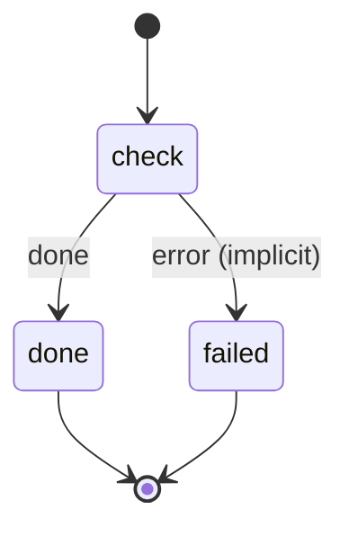

# check_versions

Compare every pinned image tag against upstream, and notify once when any has an update.

Machine: [machines/check_versions.yml](../machines/check_versions.yml)

```mermaid
stateDiagram-v2
    [*] --> check
    check --> done: done
    check --> failed: error (implicit)
    done --> [*]
    failed --> [*]
```
