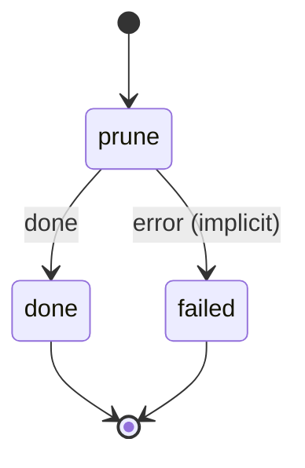

# clean_runs

Delete this project's finished runs older than OLDER_THAN; Loki keeps the history.

Machine: [machines/clean_runs.yml](../machines/clean_runs.yml)

```mermaid
stateDiagram-v2
    [*] --> prune
    prune --> done: done
    prune --> failed: error (implicit)
    done --> [*]
    failed --> [*]
```
