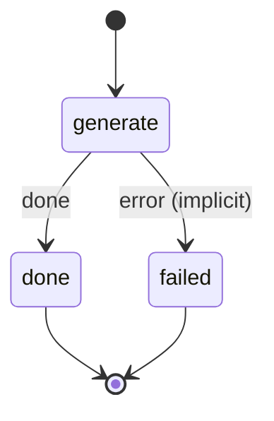

# comfy

Generate an image or video in ComfyUI from a workflow binding in lib/comfy/workflows/, the message body as the prompt.

Machine: [machines/comfy.yml](../machines/comfy.yml)

```mermaid
stateDiagram-v2
    [*] --> generate
    generate --> done: done
    generate --> failed: error (implicit)
    done --> [*]
    failed --> [*]
```
