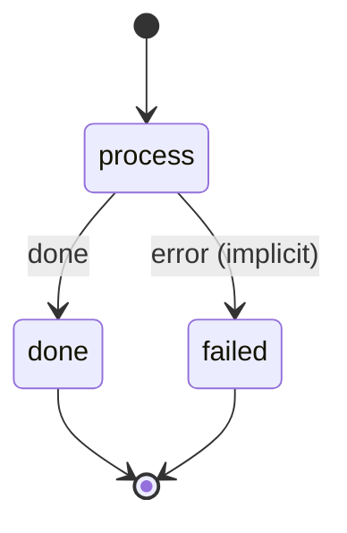

# file_processor

Download one file, put it to the processor's CRITERIA if it has any, then run the processor on it.

Machine: [machines/file_processor.yml](../machines/file_processor.yml)

```mermaid
stateDiagram-v2
    [*] --> process
    process --> done: done
    process --> failed: error (implicit)
    done --> [*]
    failed --> [*]
```
