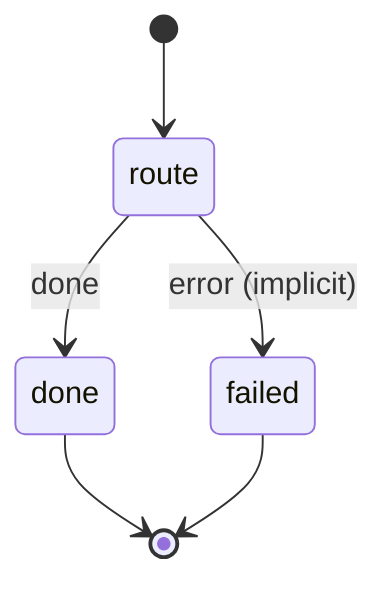

# file_router

Route one Nextcloud file event to every file processor whose PATTERN matches its path.

Machine: [machines/file_router.yml](../machines/file_router.yml)

```mermaid
stateDiagram-v2
    [*] --> route
    route --> done: done
    route --> failed: error (implicit)
    done --> [*]
    failed --> [*]
```
