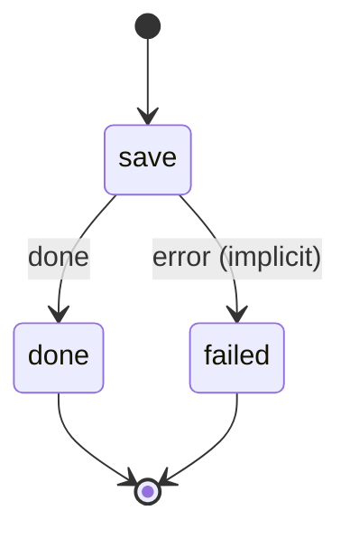

# gmail

File one email from gmail_sync, whole, in the emails directory.

Machine: [machines/gmail.yml](../machines/gmail.yml)

```mermaid
stateDiagram-v2
    [*] --> save
    save --> done: done
    save --> failed: error (implicit)
    done --> [*]
    failed --> [*]
```
