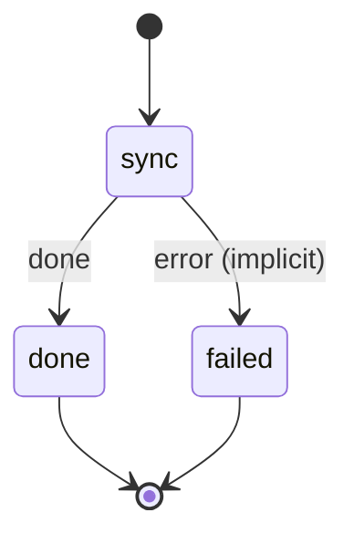

# gmail_sync

Fetch new Gmail messages under one label and emit each to GMAIL_ROUTINE, headers as params and body as body.

Machine: [machines/gmail_sync.yml](../machines/gmail_sync.yml)

```mermaid
stateDiagram-v2
    [*] --> sync
    sync --> done: done
    sync --> failed: error (implicit)
    done --> [*]
    failed --> [*]
```
