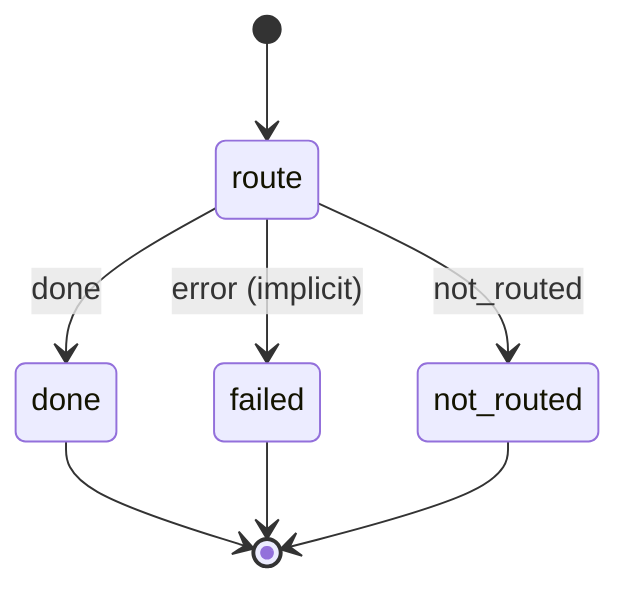

# hermes_router

Ask the hermes router profile which department fits a task, then hand it to agent_task on that profile.

Machine: [machines/hermes_router.yml](../machines/hermes_router.yml)

```mermaid
stateDiagram-v2
    [*] --> route
    route --> done: done
    route --> failed: error (implicit)
    route --> not_routed: not_routed
    done --> [*]
    failed --> [*]
    not_routed --> [*]
```
