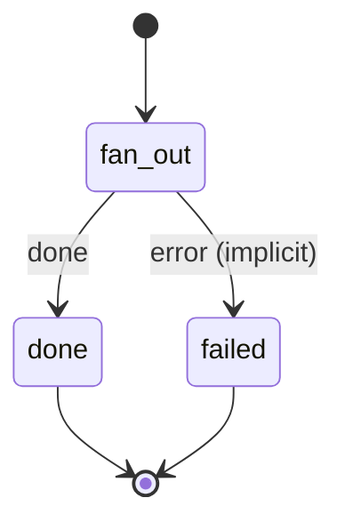

# idea_workup

Fan one flagged idea out to the research and sales departments as three agent_task questions.

Machine: [machines/idea_workup.yml](../machines/idea_workup.yml)

```mermaid
stateDiagram-v2
    [*] --> fan_out
    fan_out --> done: done
    fan_out --> failed: error (implicit)
    done --> [*]
    failed --> [*]
```
