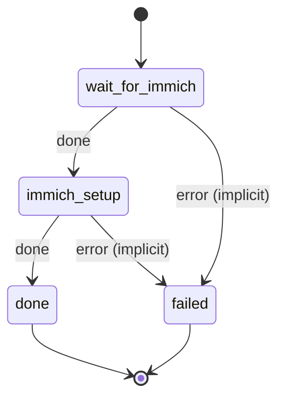

# immich_setup

Create Immich's admin from EXIST_EMAIL and add the NAS photos as a read-only External Library.

Machine: [machines/immich_setup.yml](../machines/immich_setup.yml)

```mermaid
stateDiagram-v2
    [*] --> wait_for_immich
    immich_setup --> done: done
    immich_setup --> failed: error (implicit)
    wait_for_immich --> immich_setup: done
    wait_for_immich --> failed: error (implicit)
    done --> [*]
    failed --> [*]
```
