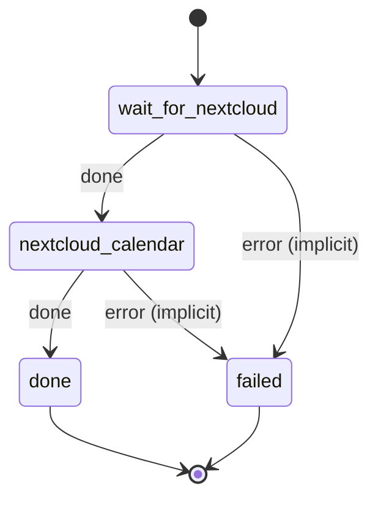

# nextcloud_calendar

Install and enable Nextcloud's Calendar app.

Machine: [machines/nextcloud_calendar.yml](../machines/nextcloud_calendar.yml)

```mermaid
stateDiagram-v2
    [*] --> wait_for_nextcloud
    nextcloud_calendar --> done: done
    nextcloud_calendar --> failed: error (implicit)
    wait_for_nextcloud --> nextcloud_calendar: done
    wait_for_nextcloud --> failed: error (implicit)
    done --> [*]
    failed --> [*]
```
