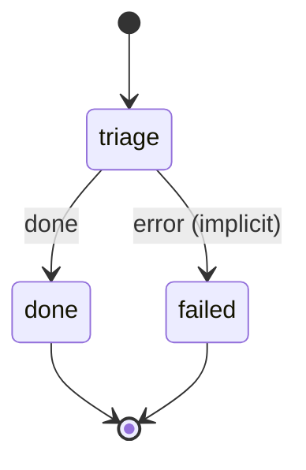

# note_triage

Ask the model one yes/no question per new or changed note, and hand the ones that pass to TRIAGE_ROUTINE.

Machine: [machines/note_triage.yml](../machines/note_triage.yml)

```mermaid
stateDiagram-v2
    [*] --> triage
    triage --> done: done
    triage --> failed: error (implicit)
    done --> [*]
    failed --> [*]
```
