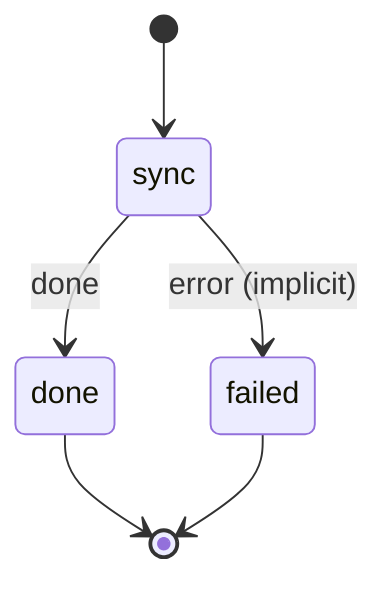

# notes

Pull the notes vault from Nextcloud, compile it, index it, and push the result to Dropbox.

Machine: [machines/notes.yml](../machines/notes.yml)

```mermaid
stateDiagram-v2
    [*] --> sync
    sync --> done: done
    sync --> failed: error (implicit)
    done --> [*]
    failed --> [*]
```
