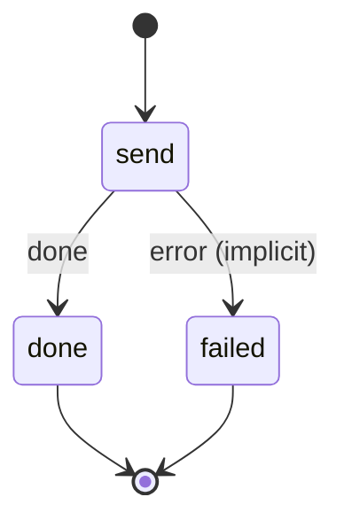

# notify

Send the message body to ntfy, falling back to Telegram when ntfy is unreachable.

Machine: [machines/notify.yml](../machines/notify.yml)

```mermaid
stateDiagram-v2
    [*] --> send
    send --> done: done
    send --> failed: error (implicit)
    done --> [*]
    failed --> [*]
```
