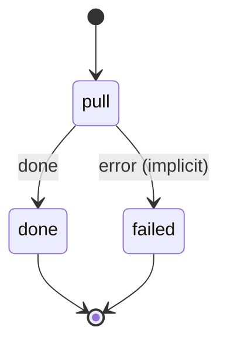

# ollama_pull

Pull an Ollama model by role (or tag), or rebuild it with a context window; idempotent.

Machine: [machines/ollama_pull.yml](../machines/ollama_pull.yml)

```mermaid
stateDiagram-v2
    [*] --> pull
    pull --> done: done
    pull --> failed: error (implicit)
    done --> [*]
    failed --> [*]
```
