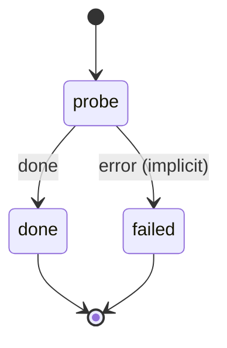

# service_health

Probe one service's HTTP endpoint and fail unless it answers with the expected status.

Machine: [machines/service_health.yml](../machines/service_health.yml)

```mermaid
stateDiagram-v2
    [*] --> probe
    probe --> done: done
    probe --> failed: error (implicit)
    done --> [*]
    failed --> [*]
```
