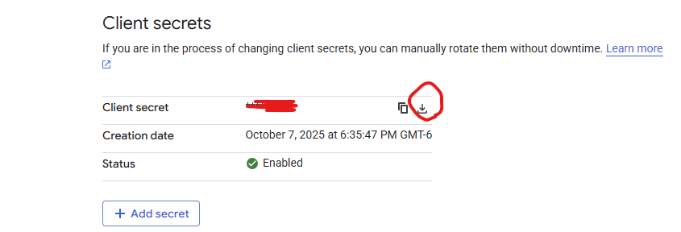

# Google Console Guide

https://console.cloud.google.com/

## Setup project

### Select an existing project or create a new project

### Create new project

### Make sure it is selected

### Go to "API's & Services" -> "Library"

### Search for "Gmail API"

### Enable Gmail API

### Go to the OAuth consent screen

### Click "Get started"

### Create OAuth Client ID for a "Desktop app" and make it "External"

### Download the JSON file (click into the client)

### Add your email as a test user

