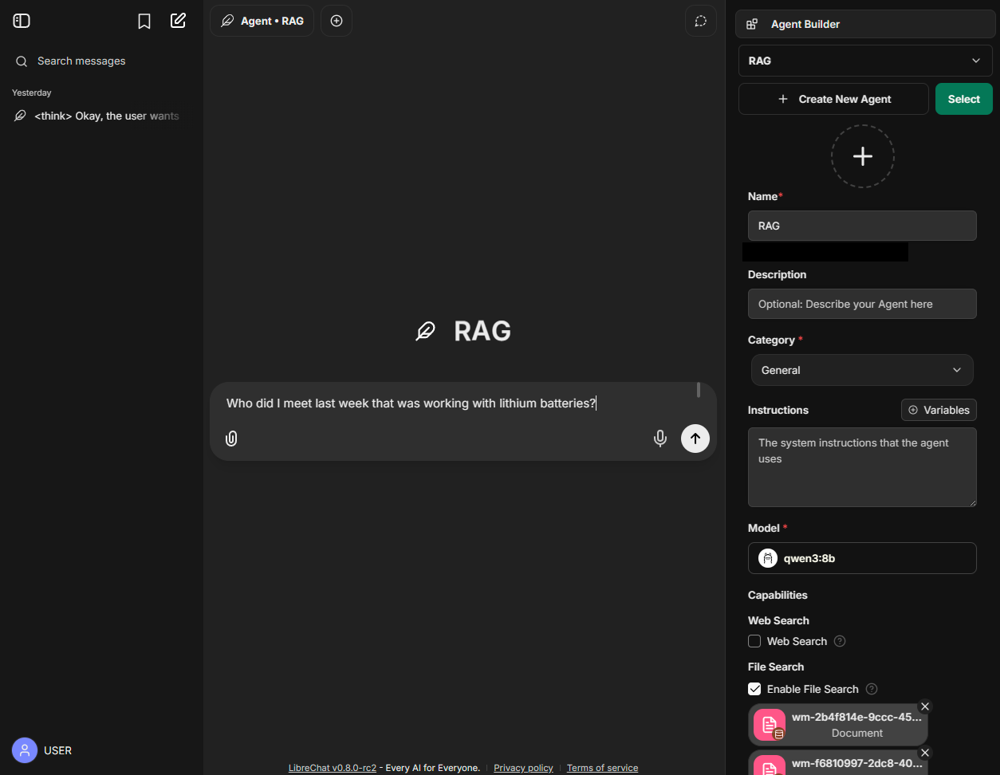

# AI

## Chat

The idea is to converse with all notes/digital context

### LibreChat - To get working

- [LibreChat](./ai/libreChat/README.md)
- [Ollama](./ollama/README.md) (alt: OpenAI)
- Perplexity
- ChatGPT
- [OpenWebUI](./openWebUI/README.md)

## Speech to text (transcription)

- [Parakeet](./parakeet/README.md) (alt: Whisper)
- [Whisper](./whisper/README.md) Speesh to text (alt: OpenAI)
- [Speaches](./speaches/README.md)

## Text to speech

- [Chatterbox](../ai/chatterbox/README.md)

### Agents

- [Flowise](./flowise/README.md)
- Huginn https://github.com/huginn/huginn
- Browser use https://github.com/browser-use/browser-use

### Background jobs

- Trigger.dev https://github.com/triggerdotdev/trigger.dev
