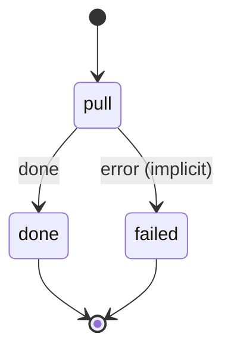

# notes_pull

Rsync-pull an external notes vault into workspace/notes, one way, without --delete unless asked.

Machine: [machines/notes_pull.yml](../machines/notes_pull.yml)

```mermaid
stateDiagram-v2
    [*] --> pull
    pull --> done: done
    pull --> failed: error (implicit)
    done --> [*]
    failed --> [*]
```
