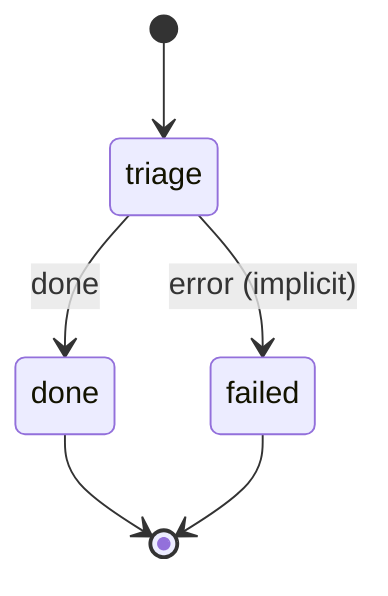

# triage

Run every enabled service's own exist.test.sh, and notify when one breaks or recovers.

Machine: [machines/triage.yml](../machines/triage.yml)

```mermaid
stateDiagram-v2
    [*] --> triage
    triage --> done: done
    triage --> failed: error (implicit)
    done --> [*]
    failed --> [*]
```
