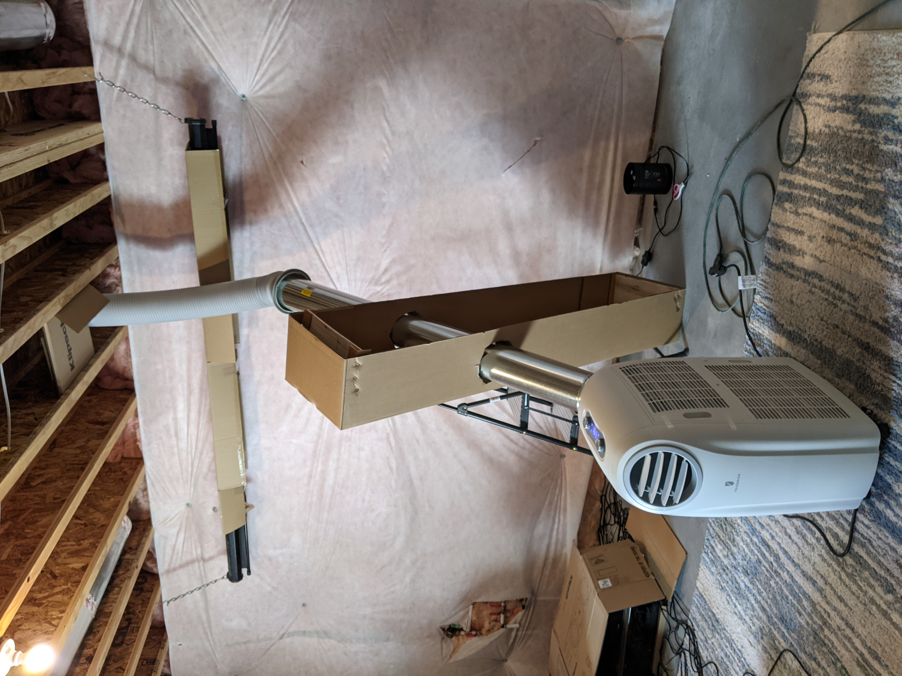
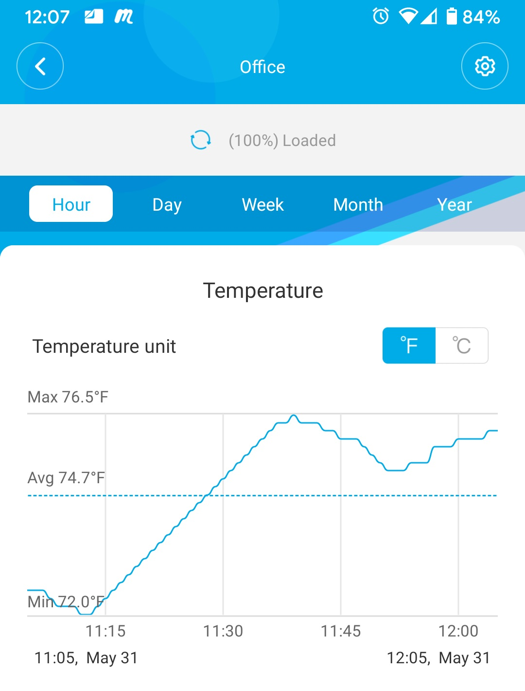
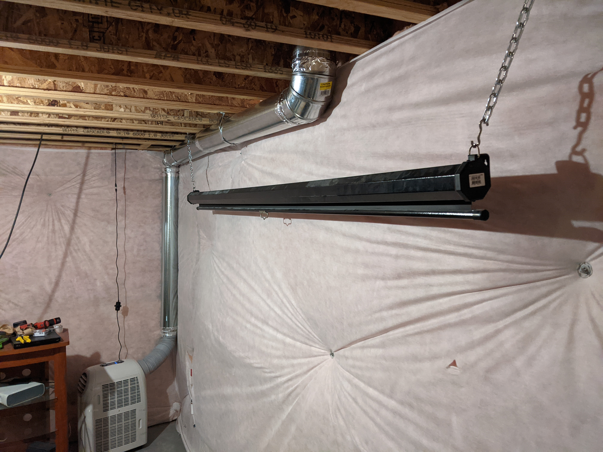

It's the start of the morning, like every other morning that has started. Brush teeth, take a shower, shave, get dressed. Most would probably get dressed after a shower, and I'm guessing not really care about the rest.

There are more things to consider for an obsessive overly analytical individual however. Months after moving into a new house, I'm still thinking about how to save more time, and make life easier.

Consider the following: Do you want your face to be wet while shaving? No: shave before brushing teeth. How far away is the shower from the water heater? Do you want an ice cold shower? No: shower after shaving and brushing teeth to save water and time.

Countless hours, and months later, I no longer think about my morning routine, and I'm satisfied that it is optimal.

Was it worth it? That's debatable. As an obsessive efficient (compulsive? disorder?) it is something I just do, not really something I decided to do necessarily, it's just a habit.

{/* truncate */}

## Where do I start automating my home?

I think it's important to know what's possible, and then let your mind wander, and over time figure out what to add. Software engineers, such as myself, are notorious for creating cool solutions, without an actual problem. It turns out solving problems, is often a much better approach.

My first problem to solve: I work from home, thanks pandemic. And I mine cryptocurrency, thanks free money. Unfortunately my PC generates a lot of heat, in my small (but actually kind of big) office. I needed to keep my office cool enough, to avoid getting a migraine while working and mining.

I bought a bluetooth thermometer to figure out just how hot it was getting in my office. 85 Degrees fahrenheit, in the winter! I wanted to make small iterative changes until I was satisfied with the results, and make minimal impact on my house.

I cut a hole in the floor of my office (the ceiling of the basement). I cut a hole near the ceiling in the wall of my office, and put another vent there to act as an "in take" because my time building custom PCs has taught me that you need airflow in AND out or it won't work as well. And everyone knows hot air rises, so the plan was to move cold air up into the office, and hot air down into the basement. I stuck 6" inline duct fans on both and fired them up. Unfortunately the impact on the temperature in my office was minimal.

Time to get serious. I bought a portable AC unit and planned to put it in the basement to avoid some of the noise. I was committed with two holes in my fresh new house, but before I make it even more permanent, I needed some real data confirming this was actually going to work.

Throughout this process I wanted to be deliberate, and have a plan for each outcome, all while being data driven. Also iteratively improving, doing as little as possible each step of the way, and trying to avoid over-architecting. Not an accident that these are all applicable programming principles.

With the AC unit rigged up, I shut off my mining and fired up Rocket League with the FPS cap off. I closed the door to my office and let it run for 20 minutes, baking the room with no AC. Then the moment of truth. It worked! Leaving it on by accident, the office temperature would even drop down to 65 Degrees!

It didn't take long to make me sick of running downstairs to turn it on and off all day.

## Enter automation

I had a Raspberry Pi lying around, so I threw [Home Assistant](https://www.home-assistant.io/installation/) onto it. Many hours of research into different smart home ecosystems led me to this decision. I also decided that I would use Z-Wave and Zigbee in order to minimize the impact on Wifi interference at my house. I like the idea of keeping everything local, and not exposing all of my smart devices to the internet.

I bought a [2-in-1 (Z-Wave and Zigbee) adapter](https://www.amazon.com/GoControl-CECOMINOD016164-HUSBZB-1-USB-Hub/dp/B01GJ826F8/) so that I wouldn't regret a decision for one over the other later.

All I really needed to rig up my "thermostat" was a temperature sensor, but this [6-in-1 motion, temperature+](https://www.amazon.com/gp/product/B0151Z8ZQY/) was the only thing I could find that didn't require batteries. I hate batteries. I don't need any more things to worry about.

I settled on [Zigbee smart plugs](https://www.amazon.com/gp/product/B08FJ5LHSN/) and found out after the fact that they also report power usage through Home Assistant, which is pretty cool. I ordered 4 more just to use for monitoring power usage.

After the initial setup with Home Assistant, I got very distracted by trying to use Add-Ons for everything. I'm probably the only one with this problem, but I thought I'd share: just install Z-Wave JS. Configuration → Integrations is where you'll go to add and manage Z-Wave JS, and HubZ Smart Home Controller (Zigbee). To add devices with Z-Wave just click Configure → Add Node. For Zigbee, click Configure → Add Device (in the bottom right).

With your devices added, head on over to Configuration → Automations. I tried to find a blueprint to save myself time, but it ended up being a waste of time.

I made two different rules. One that turns the AC on when the temperature is over 73, and there has been motion in the past 30 minutes, and it's between 6am and midnight. And one that turns the AC off when the temperature is under 73, there hasn't been motion for 30 minutes, or it's midnight.

## Where to from here?

Since I can't turn my brain off, I have started finding more ways to limit what I need to do. Like adding a smart plug in front of my Amp, DAC, and sound system in my office, so it turns on with motion. Adding [smart lights](https://www.amazon.com/gp/product/B015KQ29JI/) in my office, so they turn on with motion.

I've added [other smart lights](https://www.amazon.com/gp/product/B013OCF2EY/) that do remember their state to the master bathroom, so that I can turn down the brightness and set it to the warmest temperature possible, so I'm not blinded in the morning and evening.

I now have 8 different automations configured, and I expect to keep adding more slowly. We'll see what happens when the new standard Matter shows up, but I assume what I've done so far will still be compatible through Home Assistant.

[Discuss on Reddit](https://www.reddit.com/r/ExistentialCompany/comments/plwikl/optimizing_my_life_now_with_home_assistant/)
