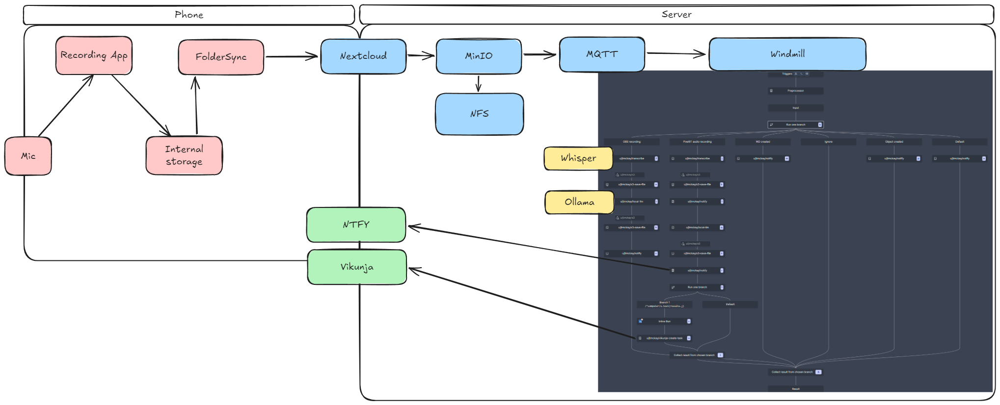

# Examples

Scripts and workflows that connect all data sources and services together.

## Meeting Transcription

- Record a meeting (phone or desktop)
- Whisper transcribes the audio
- Summary is generated and you get notified
- Tasks are added to Vikunja

## Basic Flow

## Setup Script

See [Getting Started](../getting-started) for the `./existential.sh` setup script documentation.
