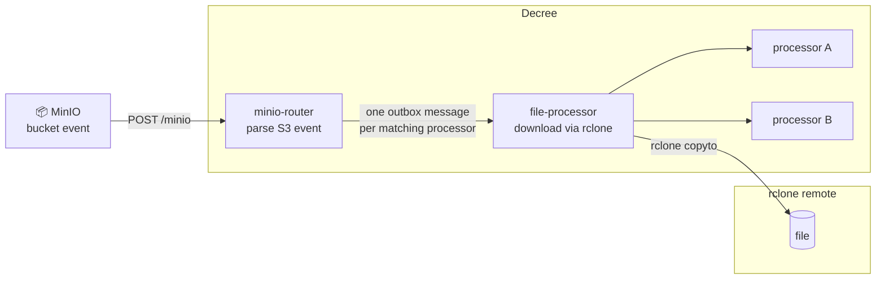

# File Change → Process

React to files being created, updated, or deleted in S3-compatible storage. When a file event arrives at the Decree webhook, `minio-router` matches the file path against registered processors and fans out one `file-processor` job per match. Each job downloads the file, runs the processor, and deletes the local copy.



## How It Works

### 1. MinIO fires the event

When a file is created, updated, or deleted in a subscribed bucket, MinIO POSTs an S3-compatible JSON payload to `http://decree-webhook:48880/minio`:

```json
{
  "EventName": "s3:ObjectCreated:Put",
  "Key": "mybucket/documents/report.pdf",
  "Records": [...]
}
```

The request includes `Authorization: Bearer <DECREE_MINIO_WEBHOOK_AUTH_TOKEN>` — set as a custom header in the MinIO notification target config.

### 2. minio-router — match and fan out

`minio-router` parses the event, constructs `FILE_SOURCE` as `<rclone_src>:<bucket>/<object-key>` (e.g. `minio:mybucket/documents/report.pdf`), and scans every script in `automations/lib/file-processors/` for a `PATTERN=` regex match.

For each matching processor it writes one message to the Decree outbox:

```yaml
---
routine: file-processor
rclone_path: minio:mybucket/documents/report.pdf
processor: my-processor
file_action: created
---
```

Multiple processors can match the same file — each runs independently as a separate Decree message.

### 3. file-processor — download, run, clean up

`file-processor` downloads the file from the rclone remote to a temp path, exports the standard `FILE_*` env vars, runs the matched processor script, then explicitly deletes the temp file. No trap-based cleanup — the delete is always the last step.

For `removed` events the download is skipped; `FILE_PATH` is empty and the processor decides what to do.

## Adding a File Processor

Create `automations/lib/file-processors/<name>.sh`:

```bash
#!/usr/bin/env bash
# PATTERN is matched against FILE_SOURCE: "<rclone_src>:<bucket>/<object-key>"
PATTERN="minio:documents/.*\.pdf$"

set -euo pipefail

if [ "$FILE_ACTION" = "removed" ]; then
    echo "Deleted: $FILE_KEY"
    exit 0
fi

# FILE_PATH is the absolute path to the downloaded temp file.
# Do not delete it — file-processor handles cleanup after this script exits.
echo "Processing $FILE_PATH"

# your logic here — call opencode, run a script, POST to an API, etc.
```

**Available env vars:**

| Variable | Example | Description |
|---|---|---|
| `FILE_SOURCE` | `minio:mybucket/docs/file.pdf` | Full rclone source path |
| `FILE_KEY` | `mybucket/docs/file.pdf` | Path after the `remote:` prefix |
| `FILE_ACTION` | `created` \| `removed` | Event type |
| `FILE_PATH` | `/tmp/file.pdf.xK3rQp` | Local temp file (empty for `removed`) |

**Pattern tips:**

```bash
PATTERN="minio:photos/.*\.(jpg|jpeg|png)$"   # specific bucket + extension
PATTERN="minio:.*\.pdf$"                      # any bucket, PDFs only
PATTERN="minio:invoices/.*"                   # everything in the invoices bucket
PATTERN=".*\.csv$"                            # any rclone remote, CSVs
```

Decree picks up the new file immediately — no restart needed.

## MinIO Setup

### Step 1 — Configure the webhook notification target

In the MinIO console go to **Administrator → Events** and add a new webhook endpoint:

| Field | Value |
|---|---|
| Identifier | `DECREE` |
| Endpoint | `http://decree-webhook:48880/minio` |
| Auth Token | your `DECREE_MINIO_WEBHOOK_AUTH_TOKEN` value |

Save and verify the target shows as reachable. The identifier `DECREE` is used in the next step — MinIO will expose the ARN `arn:minio:sqs::DECREE:webhook`.

:::warning One target is not enough
Adding the webhook target under **Events** only registers the endpoint. MinIO will not send any events until you subscribe individual buckets to it in the next step.
:::

### Step 2 — Subscribe buckets to events

For each bucket you want to monitor:

1. Go to **Buckets → [bucket name] → Events**
2. Click **Subscribe to Event**
3. Select the ARN `arn:minio:sqs::DECREE:webhook`
4. Configure the subscription:
   - **Prefix** — optional path filter (e.g. `uploads/` to only watch that folder)
   - **Suffix** — optional extension filter (e.g. `.pdf`)
   - **Events** — check `PUT` for creates/updates, `DELETE` for deletions
5. Save

Repeat for each bucket. Each bucket subscription sends events independently to the same webhook endpoint.

### Step 3 — Configure rclone

The decree container uses `/secrets/rclone/rclone.conf` for all rclone operations. Add a MinIO remote if you haven't already:

```bash
./existential.sh setup rclone
```

Name the remote `minio` (or update `rclone_src` in `services/decree/webhook/config.yml` to match your remote name).

## Testing

Send a test event directly to the webhook to verify routing without needing a real MinIO event:

```bash
curl -X POST http://localhost:48880/minio \
  -H "Authorization: Bearer <DECREE_MINIO_WEBHOOK_AUTH_TOKEN>" \
  -H "Content-Type: application/json" \
  -d '{"EventName":"s3:ObjectCreated:Put","Key":"mybucket/documents/hello.txt","Records":[]}'
```

Watch the routing happen in real time:

```bash
docker logs -f decree
```

Inspect the run log after it completes:

```bash
docker exec decree decree status
docker exec decree decree log <id-prefix>
```

To test just the routing stage (without rclone), check the inbox after the curl — `minio-router` will have written outbox messages even if `file-processor` fails:

```bash
ls automations/runs/
```

## Verifying Routine Pre-checks

```bash
docker exec decree decree routine minio-router
docker exec decree decree routine file-processor
```
