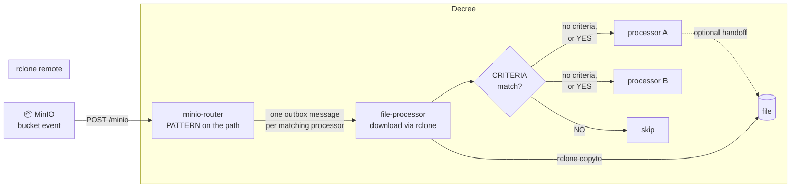

# File Processor

:::info[Mechanism, not a flow]
This is the plumbing a [flow](../flows/) sits on: how a file landing in storage becomes a
running routine. If you are here to see what the system *does*, start at
[Level 3 · Flows](../flows/). If you are wiring up your own, this and
[Build On It](../build-on-it) are the pages you want.
:::

React to files being created, updated, or deleted in S3-compatible storage. When a file event arrives at the Decree webhook, `minio-router` matches the file path against registered processors and fans out one `file-processor` job per match. Each job downloads the file (or generates a signed URL if `IS_PRE_SIGNED=true`), runs the processor, and deletes the local copy.

A processor declares up to two tests. `PATTERN` is a regex over the path — cheap, mechanical, evaluated by the router. `CRITERIA` is optional: a plain-English test of the file's *content*, put to the model by `file-processor` after the download. Splitting them that way means the expensive half only runs for files that already passed the free one. A processor with no `CRITERIA` behaves exactly as processors did before it existed.


```mermaid
flowchart LR
    A["📦 MinIO\nbucket event"] -->|POST /minio| B

    subgraph decree["Decree"]
        B["minio-router\nPATTERN on the path"]
        C["file-processor\ndownload via rclone"]
        G{"CRITERIA\nmatch?"}
        D1["processor A"]
        D2["processor B"]
        E["agent-task\nopencode → hermes"]
        B -->|"one outbox message\nper matching processor"| C
        C --> G
        G -->|"no criteria,\nor YES"| D1
        G -->|"no criteria,\nor YES"| D2
        G -->|"NO"| X["skip"]
        D1 -.->|"optional handoff"| E
    end

    subgraph storage["rclone remote"]
        E[("file")]
    end

    C -->|"rclone copyto"| E
```

## How It Works

### 1. MinIO fires the event

When a file is created, updated, or deleted in a subscribed bucket, MinIO POSTs an S3-compatible JSON payload to `http://automation-webhook:8801/minio`:

```json
{
  "EventName": "s3:ObjectCreated:Put",
  "Key": "mybucket/documents/report.pdf",
  "Records": [...]
}
```

The request includes `Authorization: Bearer <EXIST_DECREE_MINIO_WEBHOOK_AUTH_TOKEN>` — set as a custom header in the MinIO notification target config.

### 2. minio-router — match and fan out

`minio-router` parses the event, constructs `FILE_SOURCE` as `<rclone_src>:<rclone_prefix>/<object-key>` (e.g. `nextcloud:S3/documents/report.pdf`), and scans every script in `automation/lib/file-processors/` for a `PATTERN=` regex match. It also reads each processor's `IS_PRE_SIGNED=` setting to carry it into the job.

:::note The S3 bucket is not part of `FILE_SOURCE`

The router drops the bucket and puts `rclone_prefix` in its place. That is deliberate: in the default topology the bucket *is* a Nextcloud external mount, so the file is reached through the `nextcloud` remote at the mount's path, not through S3. If you point a processor at MinIO directly through an `s3` remote, the first path segment must be the bucket — so set `rclone_prefix` to the bucket name in `services/automation/webhook/config.yml`.

:::

For each matching processor it writes one message to the Decree outbox:

```yaml
---
routine: file-processor
rclone_path: minio:mybucket/documents/report.pdf
processor: my-processor
file_action: created
is_pre_signed: false
---
```

Multiple processors can match the same file — each runs independently as a separate Decree message.

### 3. file-processor — download (or reference), run, clean up

`file-processor` exports the standard `FILE_*` env vars, runs the matched processor script, then deletes any local temp file.

- **Default (`IS_PRE_SIGNED=false`)**: downloads the file via `rclone copyto` to a temp path; `FILE_PATH` is the local file.
- **Pre-signed (`IS_PRE_SIGNED=true`)**: skips the download and instead calls `rclone link` to generate a signed URL; `PRE_SIGNED_URL` is set to that URL and `FILE_PATH` remains empty. Useful when the processor needs to hand off the file to an external service rather than read it locally.
- **`removed` events**: download is always skipped; `FILE_PATH` is empty.

## Adding a File Processor

Create `automation/lib/file-processors/<name>.sh`:

```bash
#!/usr/bin/env bash
# PATTERN is matched against FILE_SOURCE: "<rclone_src>:<rclone_prefix>/<object-key>"
PATTERN="minio:documents/.*\.pdf$"
# CRITERIA is optional. Empty = the path match is the whole test.
CRITERIA=""
IS_PRE_SIGNED=false

set -euo pipefail

if [ "$FILE_ACTION" = "removed" ]; then
    echo "Deleted: $FILE_KEY"
    exit 0
fi

# FILE_PATH is the local temp file (do not delete — file-processor handles cleanup).
# PRE_SIGNED_URL is set instead of FILE_PATH when IS_PRE_SIGNED=true.
echo "Processing $FILE_PATH"

# your logic here — call opencode, run a script, POST to an API, etc.
```

**Available env vars:**

| Variable | Example | Description |
|---|---|---|
| `FILE_SOURCE` | `minio:mybucket/docs/file.pdf` | Full rclone source path |
| `FILE_KEY` | `mybucket/docs/file.pdf` | Path after the `remote:` prefix |
| `FILE_ACTION` | `created` \| `removed` | Event type |
| `FILE_PATH` | `/tmp/file.pdf.xK3rQp` | Local temp file (empty for `removed` or when `IS_PRE_SIGNED=true`) |
| `PRE_SIGNED_URL` | `https://…` | Signed URL (set when `IS_PRE_SIGNED=true`, otherwise empty) |
| `FILE_MATCH_REASON` | `Names a vendor and a due date` | The model's one-line reason the criteria gate passed (empty when `CRITERIA` is unset) |

**Script settings:**

| Setting | Default | Description |
|---|---|---|
| `PATTERN` | *(required)* | Regex matched against `FILE_SOURCE` |
| `CRITERIA` | *(empty)* | Plain-English test of the file's content; empty means the path match is the whole test |
| `IS_PRE_SIGNED` | `false` | If `true`, skip download and set `PRE_SIGNED_URL` instead |

**Pattern tips:**

```bash
PATTERN="minio:photos/.*\.(jpg|jpeg|png)$"   # specific bucket + extension
PATTERN="minio:.*\.pdf$"                      # any bucket, PDFs only
PATTERN="minio:invoices/.*"                   # everything in the invoices bucket
PATTERN=".*\.csv$"                            # any rclone remote, CSVs
```

Decree picks up the new file immediately — no restart needed.

## MinIO Setup

### Step 1 — Configure the webhook notification target

In the MinIO console go to **Administrator → Events** and add a new webhook endpoint:

| Field | Value |
|---|---|
| Identifier | `DECREE` |
| Endpoint | `http://automation-webhook:8801/minio` |
| Auth Token | your `EXIST_DECREE_MINIO_WEBHOOK_AUTH_TOKEN` value |

Save and verify the target shows as reachable. The identifier `DECREE` is used in the next step — MinIO will expose the ARN `arn:minio:sqs::DECREE:webhook`.

:::warning[One target is not enough]
Adding the webhook target under **Events** only registers the endpoint. MinIO will not send any events until you subscribe individual buckets to it in the next step.
:::

### Step 2 — Subscribe buckets to events

For each bucket you want to monitor:

1. Go to **Buckets → [bucket name] → Events**
2. Click **Subscribe to Event**
3. Select the ARN `arn:minio:sqs::DECREE:webhook`
4. Configure the subscription:
   - **Prefix** — optional path filter (e.g. `uploads/` to only watch that folder)
   - **Suffix** — optional extension filter (e.g. `.pdf`)
   - **Events** — check `PUT` for creates/updates, `DELETE` for deletions
5. Save

Repeat for each bucket. Each bucket subscription sends events independently to the same webhook endpoint.

### Step 3 — Configure rclone

The decree container uses `/secrets/rclone/rclone.conf` for all rclone operations. Add a MinIO remote if you haven't already:

```bash
./existential.sh run rclone
```

Name the remote `minio` (or update `rclone_src` in `services/automation/webhook/config.yml` to match your remote name).

## Testing

Send a test event directly to the webhook to verify routing without needing a real MinIO event:

```bash
# automation-webhook publishes no host port — it is reached over the exist
# bridge, so send the event from a container already on it.
docker exec automation curl -X POST http://automation-webhook:8801/minio \
  -H "Authorization: Bearer <EXIST_DECREE_MINIO_WEBHOOK_AUTH_TOKEN from .env.shared>" \
  -H "Content-Type: application/json" \
  -d '{"EventName":"s3:ObjectCreated:Put","Key":"mybucket/documents/hello.txt","Records":[]}'
```

Watch the routing happen in real time:

```bash
docker logs -f automation
```

Inspect the run log after it completes:

```bash
docker exec automation decree status
docker exec automation decree log <id-prefix>
```

To test just the routing stage (without rclone), check the inbox after the curl — `minio-router` will have written outbox messages even if `file-processor` fails:

```bash
ls automation/runs/
```

## Verifying Routine Pre-checks

```bash
docker exec automation decree routine minio-router
docker exec automation decree routine file-processor
```

## Matching on content, not just path

Add a `CRITERIA` line and `file-processor` puts the downloaded file to the model
before running your script:

```bash
PATTERN="minio:workspace/.*\.md$"
CRITERIA="an open question the author has not resolved"
```

The gate is deliberately stingy — it answers `NO` unless the document genuinely
matches, because a `YES` usually costs a full agent run downstream. On a match,
`FILE_MATCH_REASON` carries the model's one-line reason into your script.

Three things to know:

- **It costs one model call per file that got past `PATTERN`.** Keep the pattern
  narrow enough that the gate is not asked about everything.
- **It only works on text.** For `IS_PRE_SIGNED=true` processors and for
  `removed` events there is nothing on disk to judge, so the gate is skipped and
  the processor runs on the path match alone.
- **No answer is not the same as no match.** If the gateway is down or times out,
  `file-processor` fails the message so Decree retries it, rather than silently
  dropping the file — which would look exactly like a clean `NO`.

## Handing off to an agent

A processor's real job is usually to decide *that* something should happen, not
to do it. `agent-task` is the routine that does it: it runs `opencode run`
against hermes and files the answer in `workspace/ai/`.

```bash
cat > "${OUTBOX_DIR}/handoff-$(date +%s%N).md" << MSG
---
routine: agent-task
file_path: notes/plan.md
output_name: plan-followup
prompt: Read this note and work out what can be settled without the author.
---
MSG
```

Because OpenCode is pointed at hermes — an agent gateway that runs its own tool
loop — it inherits every MCP server hermes has registered: OpenViking search,
Firecrawl web search, Playwright. The prompt does not name tools; it says what it
wants, and hermes decides what to reach for.

`agent-task` needs `AUTOMATION_AI=opencode` (already set in
`services/automation/.env.exist`) and the rendered `services/automation/opencode.json`,
which points at `http://hermes-agent:8642/v1`.

## Triggering on workspace edits

MinIO fires events for objects written through its own API. Editing a file in
`workspace/` writes to a bind mount, which fires nothing — so the Workspace Agent
quest (`src/quests/auto-workspace-agent.md`) adds a `workspace-sync` routine that
mirrors `workspace/` into a `workspace` bucket on a cron. The mirror is what
produces the events.

That sync excludes `workspace/ai/`, and the exclusion is load-bearing:
`workspace/ai/` is where `agent-task` writes, so syncing it would make every
answer an event and every event another run. OpenViking indexes it straight off
disk regardless, so past output stays searchable — it simply cannot trigger
anything.

Two ordering rules follow from the sync being a full mirror:

1. **Sync once before subscribing the bucket.** The first pass uploads the whole
   workspace, and against a subscribed bucket that arrives as one event per file.
2. **Detection is a poll.** A change takes up to one cron interval to be noticed.
