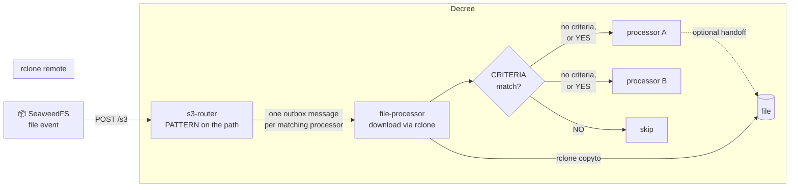

# File Processor

:::info[Mechanism, not a flow]
This is the plumbing a [flow](../flows/) sits on: how a file landing in storage becomes a
running routine. If you are here to see what the system *does*, start at
[Level 3 · Flows](../flows/). If you are wiring up your own, this and
[Build On It](../build-on-it) are the pages you want.
:::

React to files being created, updated, or deleted in S3-compatible storage. When a file event arrives at the Decree webhook, `s3-router` matches the file path against registered processors and fans out one `file-processor` job per match. Each job downloads the file (or generates a signed URL if `IS_PRE_SIGNED=true`), runs the processor, and deletes the local copy.

A processor declares up to two tests. `PATTERN` is a regex over the path — cheap, mechanical, evaluated by the router. `CRITERIA` is optional: a plain-English test of the file's *content*, put to the model by `file-processor` after the download. Splitting them that way means the expensive half only runs for files that already passed the free one. A processor with no `CRITERIA` behaves exactly as processors did before it existed.


```mermaid
flowchart LR
    A["📦 SeaweedFS
file event"] -->|POST /s3| B

    subgraph decree["Decree"]
        B["s3-router\nPATTERN on the path"]
        C["file-processor\ndownload via rclone"]
        G{"CRITERIA\nmatch?"}
        D1["processor A"]
        D2["processor B"]
        E["agent-task\n→ hermes gateway"]
        B -->|"one outbox message\nper matching processor"| C
        C --> G
        G -->|"no criteria,\nor YES"| D1
        G -->|"no criteria,\nor YES"| D2
        G -->|"NO"| X["skip"]
        D1 -.->|"optional handoff"| E
    end

    subgraph storage["rclone remote"]
        E[("file")]
    end

    C -->|"rclone copyto"| E
```

## How It Works

### 1. SeaweedFS fires the event

When a file is created, updated, renamed or deleted under a watched path, SeaweedFS POSTs a
filer event to `http://automation-webhook:8801/s3`:

```json
{
  "event_type": "create",
  "key": "/buckets/mybucket/documents/report.pdf",
  "message": { "new_entry": { "name": "report.pdf", "attributes": { "file_size": 12345 } } }
}
```

This is a **filer** event, not an S3 bucket notification — SeaweedFS does not implement the
latter at all. So `key` is a filer path under `/buckets/`, `event_type` is one of `create`,
`update`, `delete`, `rename`, and directories raise events of their own carrying
`is_directory: true`. `s3-router` strips the prefix, maps `create`/`update` to `created` and
`delete` to `removed`, splits a `rename` into a removal of the old path plus a creation of the
new one, and drops directory events.

The request includes `Authorization: Bearer <EXIST_DECREE_S3_WEBHOOK_AUTH_TOKEN>` — `bearer_token` in `nas/seaweedfs/notification.toml`.

### 2. s3-router — match and fan out

`s3-router` parses the event, constructs `FILE_SOURCE` as `<rclone_src>:<rclone_prefix>/<object-key>` (e.g. `nextcloud:S3/documents/report.pdf`), and scans every script in `automation/lib/file-processors/` for a `PATTERN=` regex match. It also reads each processor's `IS_PRE_SIGNED=` setting to carry it into the job.

:::note The S3 bucket is not part of `FILE_SOURCE`

The router drops the bucket and puts `rclone_prefix` in its place. That is deliberate: in the default topology the bucket *is* a Nextcloud external mount, so the file is reached through the `nextcloud` remote at the mount's path, not through S3. If you point a processor at the object store directly through an `s3` remote, the first path segment must be the bucket — so set `rclone_prefix` to the bucket name in `services/automation/webhook/config.yml`.

:::

For each matching processor it writes one message to the Decree outbox:

```yaml
---
routine: file-processor
rclone_path: s3:mybucket/documents/report.pdf
processor: my-processor
file_action: created
is_pre_signed: false
---
```

Multiple processors can match the same file — each runs independently as a separate Decree message.

### 3. file-processor — download (or reference), run, clean up

`file-processor` exports the standard `FILE_*` env vars, runs the matched processor script, then deletes any local temp file.

- **Default (`IS_PRE_SIGNED=false`)**: downloads the file via `rclone copyto` to a temp path; `FILE_PATH` is the local file.
- **Pre-signed (`IS_PRE_SIGNED=true`)**: skips the download and instead calls `rclone link` to generate a signed URL; `PRE_SIGNED_URL` is set to that URL and `FILE_PATH` remains empty. Useful when the processor needs to hand off the file to an external service rather than read it locally.
- **`removed` events**: download is always skipped; `FILE_PATH` is empty.

## Adding a File Processor

Create `automation/lib/file-processors/<name>.sh`:

```bash
#!/usr/bin/env bash
# PATTERN is matched against FILE_SOURCE: "<rclone_src>:<rclone_prefix>/<object-key>"
PATTERN="s3:documents/.*\.pdf$"
# CRITERIA is optional. Empty = the path match is the whole test.
CRITERIA=""
IS_PRE_SIGNED=false

set -euo pipefail

if [ "$FILE_ACTION" = "removed" ]; then
    echo "Deleted: $FILE_KEY"
    exit 0
fi

# FILE_PATH is the local temp file (do not delete — file-processor handles cleanup).
# PRE_SIGNED_URL is set instead of FILE_PATH when IS_PRE_SIGNED=true.
echo "Processing $FILE_PATH"

# your logic here — ask hermes (lib/hermes.sh), run a script, POST to an API, etc.
```

**Available env vars:**

| Variable | Example | Description |
|---|---|---|
| `FILE_SOURCE` | `s3:mybucket/docs/file.pdf` | Full rclone source path |
| `FILE_KEY` | `mybucket/docs/file.pdf` | Path after the `remote:` prefix |
| `FILE_ACTION` | `created` \| `removed` | Event type |
| `FILE_PATH` | `/tmp/file.pdf.xK3rQp` | Local temp file (empty for `removed` or when `IS_PRE_SIGNED=true`) |
| `PRE_SIGNED_URL` | `https://…` | Signed URL (set when `IS_PRE_SIGNED=true`, otherwise empty) |
| `FILE_MATCH_REASON` | `Names a vendor and a due date` | The model's one-line reason the criteria gate passed (empty when `CRITERIA` is unset) |

**Script settings:**

| Setting | Default | Description |
|---|---|---|
| `PATTERN` | *(required)* | Regex matched against `FILE_SOURCE` |
| `CRITERIA` | *(empty)* | Plain-English test of the file's content; empty means the path match is the whole test |
| `IS_PRE_SIGNED` | `false` | If `true`, skip download and set `PRE_SIGNED_URL` instead |

**Pattern tips:**

```bash
PATTERN="s3:photos/.*\.(jpg|jpeg|png)$"   # specific bucket + extension
PATTERN="s3:.*\.pdf$"                      # any bucket, PDFs only
PATTERN="s3:invoices/.*"                   # everything in the invoices bucket
PATTERN=".*\.csv$"                            # any rclone remote, CSVs
```

Decree picks up the new file immediately — no restart needed.

## SeaweedFS Setup

:::note[Already done for the default topology]
If you're using the `nextcloud` bucket (Nextcloud's `/S3` mount, SeaweedFS enabled via Core),
both steps below already happened for you: the subscription renders from
`nas/seaweedfs/notification.exist.toml`, and the `nextcloud-rclone-remote` migration configures
rclone. Read on if you're wiring up a **different** bucket, or want to know what's happening
under the hood.
:::

### Step 1 — Subscribe the path

SeaweedFS does not implement `PutBucketNotificationConfiguration`, so there is no per-bucket
subscription to make and no console step. The entire subscription is one file,
`nas/seaweedfs/notification.toml`, read by the filer at boot:

```toml
[notification.webhook]
enabled = true
endpoint = "http://automation-webhook:8801/s3"
bearer_token = "<your EXIST_DECREE_S3_WEBHOOK_AUTH_TOKEN value>"
event_types = ["create", "update", "delete", "rename"]
path_prefixes = ["/buckets/nextcloud"]
```

To watch another bucket, add it to `path_prefixes` as `/buckets/<name>` and restart seaweedfs.
Filtering is by **filer path prefix**, so `"/buckets/nextcloud/uploads"` narrows to one folder —
the equivalent of MinIO's per-subscription prefix filter. There is no suffix filter; that job
belongs to a processor's `PATTERN`, which is where it already was.

:::warning[Only one endpoint]
The webhook block supports a single target. Filter with `event_types` and `path_prefixes`
rather than adding a second one. If you genuinely need to fan out to several consumers, that is
what `s3-router` and its processors are for.
:::

Two things behave differently from MinIO, and both are handled for you in `s3-router`:

- **`key` is a filer path**, `/buckets/<bucket>/<object key>` — not a bare `<bucket>/<key>`.
- **Directories raise their own events**, carrying `is_directory: true`. The router drops them,
  so a folder rename does not queue a processor run against a directory path.

### Step 2 — Configure rclone

The decree container uses `/secrets/rclone/rclone.conf` for all rclone operations. Add a remote
if you haven't already:

```bash
./existential.sh run rclone
```

Name the remote `nextcloud` (or update `rclone_src` in
`services/automation/webhook/config.yml` to match your remote name). Talking to seaweedfs
directly over `s3` rather than through Nextcloud's WebDAV? Use `provider = Other` with
`force_path_style = true`.
## Testing

Send a test event directly to the webhook to verify routing without needing a real file event:

```bash
# automation-webhook publishes no host port — it is reached over the exist
# bridge, so send the event from a container already on it.
docker exec automation curl -X POST http://automation-webhook:8801/s3 \
  -H "Authorization: Bearer <EXIST_DECREE_S3_WEBHOOK_AUTH_TOKEN from .env.shared>" \
  -H "Content-Type: application/json" \
  -d '{"EventName":"s3:ObjectCreated:Put","Key":"mybucket/documents/hello.txt","Records":[]}'
```

Watch the routing happen in real time:

```bash
docker logs -f automation
```

Inspect the run log after it completes:

```bash
docker exec automation decree status
docker exec automation decree log <id-prefix>
```

To test just the routing stage (without rclone), check the inbox after the curl — `s3-router` will have written outbox messages even if `file-processor` fails:

```bash
ls automation/runs/
```

## Verifying Routine Pre-checks

```bash
docker exec automation decree routine s3-router
docker exec automation decree routine file-processor
```

## Matching on content, not just path

Add a `CRITERIA` line and `file-processor` puts the downloaded file to the model
before running your script:

```bash
PATTERN="nextcloud:S3/workspace/.*\.md$"
CRITERIA="an open question the author has not resolved"
```

The gate is deliberately stingy — it answers `NO` unless the document genuinely
matches, because a `YES` usually costs a full agent run downstream. On a match,
`FILE_MATCH_REASON` carries the model's one-line reason into your script.

Three things to know:

- **It costs one model call per file that got past `PATTERN`.** Keep the pattern
  narrow enough that the gate is not asked about everything.
- **It only works on text.** For `IS_PRE_SIGNED=true` processors and for
  `removed` events there is nothing on disk to judge, so the gate is skipped and
  the processor runs on the path match alone.
- **No answer is not the same as no match.** If the gateway is down or times out,
  `file-processor` fails the message so Decree retries it, rather than silently
  dropping the file — which would look exactly like a clean `NO`.

## Handing off to an agent

A processor's real job is usually to decide *that* something should happen, not
to do it. `agent-task` is the routine that does it: it calls the hermes gateway
and files the answer in `workspace/ai/`.

```bash
cat > "${OUTBOX_DIR}/handoff-$(date +%s%N).md" << MSG
---
routine: agent-task
file_path: notes/plan.md
output_name: plan-followup
prompt: Read this note and work out what can be settled without the author.
---
MSG
```

Because hermes is an agent gateway that runs its own tool loop, the task inherits
every MCP server hermes has registered: OpenViking search, Firecrawl web search,
Playwright. The prompt does not name tools; it says what it wants, and hermes
decides what to reach for. The gateway is called directly rather than through
OpenCode — [why](./routing#why-not-opencode).

`agent-task` needs `HERMES_API_KEY` (passed through once hermes is enabled), `curl`
and `jq`, and `/workspace/ai` mounted into the decree container.

## Triggering on workspace edits

SeaweedFS fires events for objects written through its own API. Editing a file in
`workspace/` writes to a bind mount, which fires nothing — so a `workspace-sync`
routine bisyncs `workspace/` with a `workspace/` subfolder of the `nextcloud`
bucket (the same one Nextcloud mounts at `/S3`) on a cron. The sync is what
produces the events — in both directions, since it's a two-way `rclone bisync`,
not a one-way mirror. This is on by default: the Core quest activates the cron
whenever SeaweedFS is enabled (see [Getting Started](../getting-started#workspace)),
and `workspace-sync` itself subscribes the bucket to the webhook — no manual
setup either way.

That sync excludes `workspace/ai/`, and the exclusion is load-bearing:
`workspace/ai/` is where `agent-task` writes, so syncing it would make every
answer an event and every event another run. OpenViking indexes it straight off
disk regardless, so past output stays searchable — it simply cannot trigger
anything.

Two things worth knowing about that cron:

1. **The first run subscribes itself, safely.** With no prior sync state, the
   first pass uploads the whole workspace in one go (`rclone bisync --resync`)
   *before* anything is subscribed to the webhook — subscribing first would
   turn that bulk upload into one event per file. `workspace-sync` queues the
   subscription as a follow-up message only once that first sync succeeds, so
   the ordering can't be gotten wrong by hand.
2. **Detection is a poll.** A change on the local side takes up to one cron
   interval to be noticed. A change on the SeaweedFS/Nextcloud side is not a
   poll — it reaches `workspace/` within about a second, live, via the
   `workspace-pull` file processor (also on by default; see its own header
   comment at `automation/lib/file-processors.example/workspace-pull.sh`).

## Triggering decree from workspace/ — the outbox

Hermes (and anything else confined to `workspace/`) has no mount into
`automation/` and shouldn't get one — routine scripts are read-only from
inside the decree daemon on purpose. `workspace/outbox/` is the one supported
way in: drop a markdown file there and it becomes a real decree message,
relayed by the `outbox-relay` file processor over the same webhook path
`workspace-pull` uses (on by default whenever SeaweedFS is enabled, no separate
setup).

```markdown
---
routine: agent-task
prompt: Summarize this week's notes.
correlation_id: D0002-1939-triage-0
---
```

`routine` is required — `workspace/ai/decree-routines.md` (kept current by the
`routines-snapshot` routine) lists what's enabled and its parameters. Any
other frontmatter field is forwarded as a parameter to that routine.
`correlation_id` is optional and free-form: a routine invoked from a decree
workflow has one in its environment (see `agent-task.sh`), and passing it
along lets whatever eventually reads the result trace it back to what started
the flow. It is not decree's own `chain` — every relayed message still gets
its own fresh chain — just a plain tag carried between messages. It is also
picked up by decree's own Loki logging whenever a message sets it, so
`{job="decree"} |= "correlation_id=<value>"` in Grafana shows every step of
one flow even though each step ran as its own separate chain.

A few things worth knowing about the relay itself:

- **It runs at most once per message.** Once a file is relayed, its path and
  content are remembered for a day; a repeat of the exact same file (a
  redelivered webhook event, for instance) is skipped, not run again. Drop the
  same routine with different content at the same filename and it still runs
  — the guarantee is against replaying identical work, not against reusing a
  name.
- **It cleans up after itself.** A successfully relayed file is deleted from
  `workspace/outbox/` on both the local and bucket side, so the directory is a
  real outbox — empty once its mail is sent — rather than an accumulating log.
- **A malformed or non-message file is skipped, not run.** Only a file whose
  first line is `---` is treated as a message; a plain note or a README that
  merely shows an example format is left alone.
