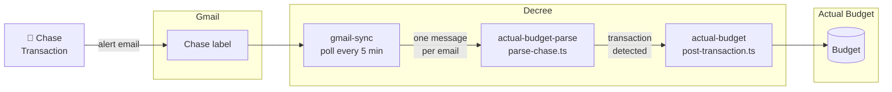

# Gmail → Chase → Actual Budget

Automatically imports Chase transaction alert emails into Actual Budget. A cron job polls a Gmail label every 5 minutes, routes matching emails through a parser, and posts any transactions it finds to your Actual Budget account.



## How It Works

### 1. Cron trigger

`automations/cron/gmail-chase.md` fires the `gmail-sync` routine every 5 minutes. It sets `GMAIL_LABEL_FILTER` to your Chase label and `GMAIL_ROUTINE` to `actual-budget-parse`. Fields prefixed `fwd_` are forwarded into each child message — this is how `parse_script` and `account_id` travel down the chain.

### 2. gmail-sync

Fetches any new emails from the Chase label using Gmail's History API (incremental — only emails since the last run). Each email is written as a markdown file to the Decree outbox with `routine: actual-budget-parse` in the frontmatter.

### 3. actual-budget-parse

Runs `parse-chase.ts` against the email body. The parser looks for a dollar amount and payee in the subject line (Chase alert format: `A charge of $X.XX at PAYEE`). If a transaction is found, it writes a new outbox message targeting `actual-budget`. If the email isn't a transaction alert, the message is discarded silently.

### 4. actual-budget

Calls `post-transaction.ts` using `@actual-app/api` to post the transaction to your Actual Budget server. Reads credentials from `/secrets/actual-budget/credentials.env` and the account ID from the message frontmatter.

## Setup

Run these steps in order. Each builds on the previous one.

### Step 1 — Gmail OAuth

If you haven't already authorized Gmail access:

```bash
./existential.sh setup gmail
```

This grants Decree read-only Gmail access and automatically saves your label list to `/secrets/gmail/labels.json`. See [Gmail](../integrations/gmail) for full instructions.

If you've already set up Gmail but need to refresh the label cache (e.g. you added a new label):

```bash
./existential.sh setup gmail-labels
```

### Step 2 — Actual Budget credentials

```bash
./existential.sh setup actual-budget
```

Connect to your Actual Budget server, select a budget, and save credentials. At the end, the script prints all your accounts with their IDs and saves them to `/secrets/actual-budget/accounts.json` for use in the next step.

See [Actual Budget](../integrations/actual-budget) for full instructions.

### Step 3 — Create the cron

```bash
./existential.sh setup gmail-chase-cron
```

An interactive prompt will:

1. List your custom Gmail labels — select the one Chase sends alerts to
2. List your open Actual Budget accounts — select the one to post transactions to
3. Confirm the schedule (default: `*/5 * * * *`)
4. Write `automations/cron/gmail-chase.md`

No restart needed — Decree picks up new cron files on the next tick.

## Verifying

Check that the routines are registered and passing pre-checks:

```bash
docker exec decree decree routine actual-budget-parse
docker exec decree decree routine actual-budget
```

Watch the next cron fire and inspect the run log:

```bash
docker exec decree decree status
docker exec decree decree log <id-prefix>
```

To test immediately without waiting for the cron, drop a message manually:

```bash
cat > automations/inbox/test-chase.md << 'EOF'
---
routine: actual-budget-parse
parse_script: /work/.decree/lib/actual-budget/parse-chase.ts
account_id: <your-account-id>
---
A charge of $42.00 at WHOLE FOODS has been made on your card ending in 1234.
EOF
```

## Adding More Banks

The parser is generic — `actual-budget-parse` accepts any `parse_script` that reads a message file and outputs JSON:

```json
{ "amount": 4200, "payee": "Whole Foods", "date": "2026-04-20", "notes": "..." }
```

To add a new bank, create `automations/lib/actual-budget/parse-<bank>.ts` following the same interface as `parse-chase.ts`, then run `setup gmail-chase-cron` again pointing to the new label and script.
