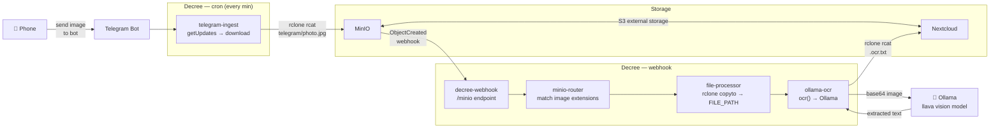

# Telegram Image → OCR

Photograph a receipt, document, or any text-bearing image and send it to a Telegram bot. Decree polls the bot every minute, downloads new photos to MinIO, and the file-processor pipeline automatically OCRs each image with Ollama. The extracted text is saved next to the original image in Nextcloud.



## How It Works

### 1. Send an image to the Telegram bot

The user photographs a receipt, handwritten note, or any document and sends it to the configured Telegram bot. The bot token stays in `/secrets/telegram/credentials.env` — Decree handles everything else.

### 2. telegram-ingest polls for new photos

A cron trigger fires `telegram-ingest` every minute. The routine calls `getUpdates` with a cursor offset stored in `/secrets/telegram/offset.txt`. For each new photo or image document message it:

1. Calls `getFile` to resolve the Telegram file path
2. Streams the download via `curl` and pipes it through `rclone rcat` to `TELEGRAM_RCLONE_DEST` (default `nextcloud:S3/telegram`)
3. Advances the offset cursor so the same message is never processed twice

### 3. MinIO fires the webhook

When the image file lands in MinIO, an `ObjectCreated` event is POSTed to the Decree webhook endpoint. This is the same pipeline used for any file arriving in a watched bucket.

### 4. minio-router matches image extensions

`minio-router` scans the `ollama-ocr` processor and reads its pattern:

```bash
PATTERN='\.(jpg|jpeg|png|webp|gif|heic|heif|tiff?|bmp)$'
IS_PRE_SIGNED=false
```

A match enqueues a `file-processor` message with `is_pre_signed: false` — the file will be downloaded locally.

### 5. file-processor downloads the image

`file-processor` runs `rclone copyto` to pull the image into a temp path and exports it as `FILE_PATH`. No pre-signed URL is involved — the full image bytes are needed to encode as base64 for the vision API.

### 6. ollama-ocr extracts the text

`ollama-ocr.sh` invokes `ocr.ts`, which:

1. Reads the image from `FILE_PATH` and encodes it as base64
2. POSTs to `http://ollama:11434/api/generate` with the configured vision model and an extraction prompt
3. Writes the returned text to stdout

The shell processor pipes that output via `rclone rcat` to Nextcloud at the same path with `.ocr.txt` appended:

```
telegram/1745000000_AgADjk.jpg
telegram/1745000000_AgADjk.jpg.ocr.txt   ← created automatically
```

## Prerequisites

- **Telegram bot** created via [@BotFather](https://t.me/BotFather) — save the token
- **MinIO** receiving `ObjectCreated` events and forwarding them to the Decree webhook (see [File Change → Process](./file-change-processing))
- **Nextcloud + MinIO** configured with MinIO as S3 external storage (so images land in both)
- **Ollama** running with a vision-capable model pulled (e.g. `llava`, `llava-phi3`, `moondream`)
- **rclone** configured with a `nextcloud` remote

## Setup

### Step 1 — Create a Telegram bot

Open Telegram, message [@BotFather](https://t.me/BotFather), and run `/newbot`. Copy the token it gives you.

### Step 2 — Save the bot token

```bash
mkdir -p services/decree/secrets/telegram
cat > services/decree/secrets/telegram/credentials.env << 'EOF'
TELEGRAM_BOT_TOKEN=your-token-here
EOF
```

The secrets directory is bind-mounted into the decree container at `/secrets/telegram/`.

### Step 3 — Pull a vision model in Ollama

```bash
docker exec ollama ollama pull llava
```

Any Ollama-compatible vision model works. `llava` is a solid general-purpose choice; `llava-phi3` is faster on CPU.

### Step 4 — Enable the routine and activate the cron

Enable `telegram-ingest` in `automations/config.yml`:

```yaml
routines:
  telegram-ingest:
    enabled: true
```

Copy and activate the example cron:

```bash
cp automations/cron/telegram-poll.md.example automations/cron/telegram-poll.md
```

Edit `TELEGRAM_RCLONE_DEST` if your bucket path differs. Decree picks up the new cron on its next tick — no restart needed.

### Step 5 — MinIO webhook and rclone

Follow the MinIO setup in [File Change → Process](./file-change-processing#minio-setup) to subscribe your `telegram` bucket to `ObjectCreated` events, and ensure your rclone `nextcloud` remote is configured:

```bash
./existential.sh setup rclone
```

## Customization

| Variable | Default | Description |
|---|---|---|
| `TELEGRAM_RCLONE_DEST` | `nextcloud:S3/telegram` | Where downloaded images are stored (triggers the OCR pipeline) |
| `FILE_SUFFIX` | `.ocr.txt` | Suffix appended to the image path for the OCR output |
| `OUTPUT_RCLONE` | `nextcloud` | rclone remote where the OCR result is saved |
| `OCR_MODEL` | `llava` | Ollama vision model used for text extraction |
| `OLLAMA_URL` | `http://ollama:11434` | Ollama API base URL |

## Testing

Drop a test image manually into the rclone destination to bypass the Telegram step and verify the OCR pipeline:

```bash
rclone copyto /path/to/test.jpg nextcloud:S3/telegram/test.jpg \
  --config services/decree/secrets/rclone/rclone.conf
```

Then send a synthetic MinIO event:

```bash
curl -X POST http://localhost:48880/minio \
  -H "Authorization: Bearer <DECREE_MINIO_WEBHOOK_AUTH_TOKEN>" \
  -H "Content-Type: application/json" \
  -d '{"EventName":"s3:ObjectCreated:Put","Key":"telegram/test.jpg","Records":[]}'
```

Watch the run complete:

```bash
docker logs -f decree
docker exec decree decree status
docker exec decree decree log <id-prefix>
```

## Reusing the OCR function

`ocr.ts` is a standalone library importable in any other TypeScript routine:

```typescript
import { ocr } from "/work/.decree/lib/ocr";

const text = await ocr("/tmp/some-file.png", {
  model: "llava-phi3",
  prompt: "What does this receipt total?",
});
```
