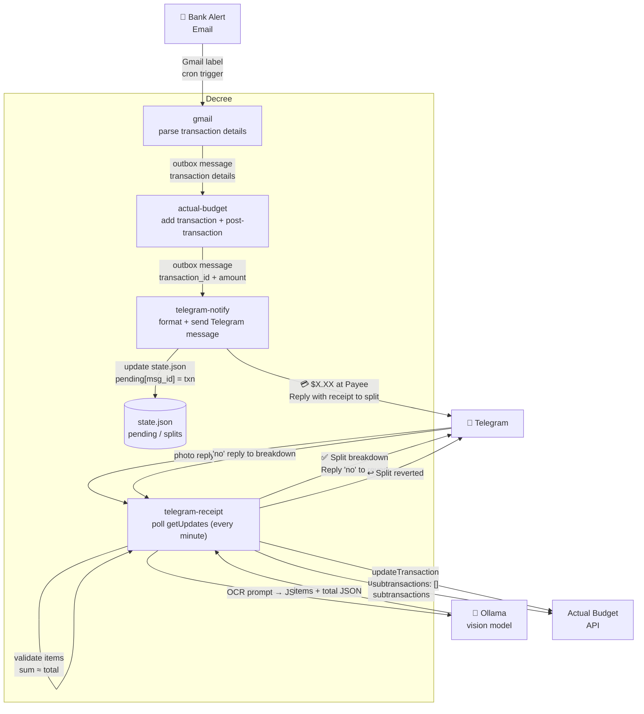

# Bank Alert → Receipt Split

A full end-to-end flow: a bank alert email arrives in Gmail, the transaction is parsed and saved to Actual Budget, a Telegram notification fires, and if you reply with a receipt photo the transaction is automatically split into line items — all without leaving Telegram.



## How It Works

### 1. Bank alert arrives in Gmail

A bank sends a transaction alert email. The `gmail` routine detects it via a Gmail label filter and enqueues an outbox message with the transaction fields parsed from the email body.

### 2. Transaction saved to Actual Budget

`actual-budget` calls `post-transaction.ts` to create the transaction, then captures its assigned UUID. If `/secrets/telegram/credentials.env` is present, it immediately enqueues a `telegram-notify` message for the sidecar flow.

### 3. Telegram notification sent

`telegram-notify` formats and sends a message to your configured chat:

```
💳 -$47.23 at Whole Foods Market on 2026-04-22

Reply with a receipt photo to split this transaction.
```

The message ID is stored in `state.json` under `pending[msg_id]` so the receipt handler can match photo replies to the right transaction.

### 4. Receipt photo triggers OCR

`telegram-receipt` polls `getUpdates` every minute. When it detects a photo:

- **Reply to the notification** — matched to that specific transaction via `reply_to_message_id`
- **Any other photo** — matched to the most recently sent notification (`last_pending_message_id`)

The photo is downloaded from Telegram, then OCR'd by `ocr.ts` using the Ollama vision model with a structured prompt:

```
Analyze this receipt and return ONLY a JSON object — no explanation, no markdown fences.
Format: {"items":[{"name":"string","amount":0.00}],"total":0.00}
Include every line item. Use negative amounts for discounts. "total" must match the receipt grand total.
```

### 5. Validation

Before splitting, the routine verifies the OCR output:

- JSON must have `items` and `total`
- Sum of all item amounts must match `total` within 2 cents (rounding tolerance)

If validation fails, the user gets an error message and can retry with a clearer photo.

### 6. Transaction split

`split-transaction.ts` calls the Actual Budget API:

```typescript
await api.updateTransaction(transactionId, {
  subtransactions: splits.map((s) => ({ amount: s.amount_cents, notes: s.name })),
});
```

A breakdown is sent back to Telegram:

```
✅ Split into 4 items:
• Organic Milk: $4.99
• Sourdough Bread: $5.49
• Chicken Thighs: $12.30
• Produce: $24.45
Total: $47.23 ✓

Reply no to revert.
```

### 7. Reverting a split

Replying `no` (case-insensitive) to the breakdown message calls `revert-split.ts`:

```typescript
await api.updateTransaction(transactionId, { subtransactions: [] });
```

The transaction is restored as a single entry and Telegram confirms the revert.

## Prerequisites

- **Existing bank alert flow** set up and working (see [Bank Alert → Actual Budget](./transaction-gmail-actual-budget))
- **Actual Budget** running and accessible
- **Telegram bot** created and credentials configured (see [Telegram integration](../integrations/telegram))
- **Ollama** running with a vision-capable model (e.g. `llava`) loaded

## Setup

### Step 1 — Configure Telegram

Follow the [Telegram integration guide](../integrations/telegram) to:

1. Create a bot with @BotFather
2. Get your chat ID
3. Save credentials to `services/decree/secrets/telegram/credentials.env`

### Step 2 — Enable routines

In `automations/config.yml`:

```yaml
routines:
  telegram-notify:
    enabled: true
  telegram-receipt:
    enabled: true
```

### Step 3 — Activate the receipt polling cron

```bash
cp automations/cron/telegram-receipt-poll.md.example automations/cron/telegram-receipt-poll.md
```

This schedules `telegram-receipt` to run every minute. Decree picks it up on the next tick — no restart needed.

### Step 4 — Verify

Check all pre-checks pass:

```bash
docker exec decree decree routine telegram-notify
docker exec decree decree routine telegram-receipt
```

Send a test notification manually:

```bash
docker exec decree decree run --routine telegram-notify \
  --param transaction_id=test-123 \
  --param amount_cents=-4723 \
  --param payee_name="Whole Foods Market" \
  --param date=2026-04-22
```

## Customization

| Variable | Default | Description |
|---|---|---|
| `TELEGRAM_RCLONE_DEST` | `nextcloud:S3/telegram` | Where non-receipt photos are saved (generic uploads) |
| `OCR_MODEL` | `llava` | Ollama vision model used for receipt OCR |
| `OLLAMA_URL` | `http://ollama:11434` | Ollama API base URL |

## State File

All pending notifications and active splits are tracked in `/secrets/telegram/state.json`. Inspect it at any time:

```bash
cat services/decree/secrets/telegram/state.json | jq .
```

To reset state (e.g. after testing):

```bash
echo '{"pending":{},"splits":{},"last_pending_message_id":null}' \
  > services/decree/secrets/telegram/state.json
```
