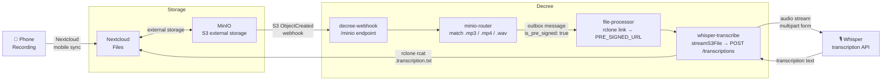

# Recording → Transcription

Automatically transcribe any audio or video recording dropped into Nextcloud. The moment a file lands in MinIO, Decree generates a pre-signed URL, streams the audio directly to Whisper, and saves the transcript next to the original file — no manual steps, no intermediate storage.



## How It Works

### 1. Phone uploads the recording

The Nextcloud mobile app auto-syncs your phone's recordings folder to Nextcloud. Any `.mp3`, `.mp4`, or `.wav` file uploaded this way flows into MinIO via Nextcloud's S3 external storage.

### 2. MinIO fires the webhook

When the file lands in MinIO, it POSTs an `s3:ObjectCreated` event to the Decree webhook endpoint. The `rclone_src` and `rclone_prefix` in the webhook config tell `minio-router` how to construct the rclone path used in all subsequent steps.

### 3. minio-router matches the file

`minio-router` scans every processor script in `automations/lib/file-processors/` for a `PATTERN=` match against the full rclone path. The `whisper-transcribe` processor declares:

```bash
PATTERN='\.[Mm][Pp][34]$|\.[Ww][Aa][Vv]$'
IS_PRE_SIGNED=true
```

It matches `.mp3`, `.mp4`, and `.wav` case-insensitively. Because `IS_PRE_SIGNED=true`, the outbox message carries `is_pre_signed: true` — telling `file-processor` not to download the file.

### 4. file-processor generates a signed URL

Instead of downloading the file, `file-processor` calls `rclone link` to generate a pre-signed URL for the audio file and exports it as `PRE_SIGNED_URL`. No audio data touches the Decree container's disk.

### 5. whisper-transcribe streams to Whisper

`whisper-transcribe.sh` invokes `whisper-transcribe.ts`, which:

1. Calls `streamS3File(PRE_SIGNED_URL)` — does a HEAD for metadata, then fetches the audio as a blob
2. Wraps it in a `File` with the correct content-type
3. POSTs it to `http://whisper:8000/v1/audio/transcriptions` as multipart form data
4. Writes the returned transcription text to stdout

### 6. Transcript saved next to the original

The bash processor pipes the transcription text through `rclone rcat` directly into Nextcloud at the same path as the audio file, with `.transcription.txt` appended:

```
recordings/2026-04-22 Meeting.mp3
recordings/2026-04-22 Meeting.mp3.transcription.txt   ← created automatically
```

## Prerequisites

- **Nextcloud** running with MinIO configured as S3 external storage
- **MinIO** webhook sending `ObjectCreated` events to the Decree webhook endpoint (see [File Change → Process](./file-change-processing))
- **Whisper** container running and reachable at `http://whisper:8000`
- **rclone** configured with a `nextcloud` remote (or whichever remote matches your `rclone_src` webhook setting)
- **Nextcloud mobile app** with auto-upload enabled for your recordings folder

## Setup

### Step 1 — MinIO webhook

Follow the MinIO setup in [File Change → Process](./file-change-processing#minio-setup) to register the Decree webhook target and subscribe your recordings bucket to `ObjectCreated` events.

### Step 2 — rclone remote

Ensure your rclone config has a remote that can access the files MinIO is receiving events for:

```bash
./existential.sh setup rclone
```

The remote name must match `rclone_src` in `services/decree/webhook/config.yml` (default: `nextcloud`).

### Step 3 — Enable Whisper

Start the Whisper container if it isn't already running:

```bash
docker compose -f ai/whisper/docker-compose.yml up -d
```

Whisper will download the default model on first use. No further configuration is required — the `whisper-transcribe` processor defaults to letting Whisper pick its own model.

### Step 4 — Confirm the processor is active

The `whisper-transcribe` processor is auto-discovered from `automations/lib/file-processors/`. No registration step is needed. Verify the pre-checks pass:

```bash
docker exec decree decree routine file-processor
```

### Step 5 — Configure Nextcloud mobile auto-upload

In the Nextcloud mobile app, enable auto-upload for your phone's voice recordings or screen recordings folder. Files are uploaded to Nextcloud, synced to MinIO, and the transcription flow triggers automatically.

## Customization

Override any of these in the processor script or pass them as frontmatter params:

| Variable | Default | Description |
|---|---|---|
| `FILE_SUFFIX` | `.transcription.txt` | Suffix appended to the audio file path for the output |
| `OUTPUT_RCLONE` | `nextcloud` | rclone remote where the transcript is saved |
| `WHISPER_MODEL` | *(empty — Whisper default)* | Model name passed to the transcription API |

## Testing

Send a synthetic MinIO event to trigger the flow end-to-end:

```bash
curl -X POST http://localhost:48880/minio \
  -H "Authorization: Bearer <DECREE_MINIO_WEBHOOK_AUTH_TOKEN>" \
  -H "Content-Type: application/json" \
  -d '{"EventName":"s3:ObjectCreated:Put","Key":"recordings/test.mp3","Records":[]}'
```

Watch processing in real time:

```bash
docker logs -f decree
```

Inspect the completed run:

```bash
docker exec decree decree status
docker exec decree decree log <id-prefix>
```
