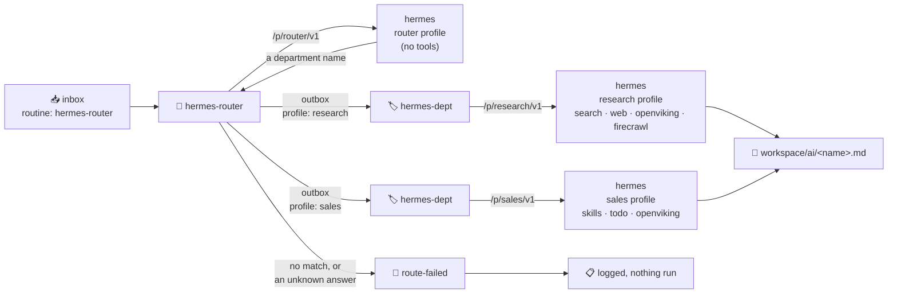

# Routing to Departments

:::info[Mechanism, not a flow]
This is the plumbing under agent work: how a task becomes a *particular* agent's task. If you
are here to see what the system does, start at [Level 3 · Flows](../flows/).
:::

A task arrives with no idea who should handle it. `hermes-router` reads it, names one
department, and writes a decree message naming that department. The department answers with its
own tools and files the result in `workspace/ai/`.

There is one routine for all of them — `hermes-dept` — because a department's identity is not
code. It is a profile definition in `ai/hermes/profiles/<name>/profile.yml`, and *that* is what
both the router and hermes itself read.



## Why route at all

A hermes profile is its own `HERMES_HOME`: its own `config.yaml`, `.env`, `SOUL.md` and
`skills/`. With `GATEWAY_MULTIPLEX_PROFILES` set, every profile is served off the one listener
at `/p/<name>/v1`, so a caller picks a profile — and therefore a toolset and an MCP server list
— by URL alone.

That matters because tool schemas are the expensive axis of a hermes prompt. Measured on this
stack:

| Profile | Fixed prompt | Tools |
|---|---|---|
| default | ~69 KB (~17,000 tokens) | 21 |
| research | ~15 KB | 4 toolsets + firecrawl |
| sales | ~15 KB | 2 toolsets |
| router | ~2.6 KB (~650 tokens) | 0 |

A skill costs about 76 bytes in the always-on index; a tool schema costs about 2.4 KB. So the
lever is *tools*, not agents — a department can hold thirty agents for the price of one tool.
Routing on the tool-free profile is what makes it cheap enough to run on every message.

## Adding a department

A department is one directory in `ai/hermes/profiles/`. Create
`ai/hermes/profiles/legal/profile.yml`:

```yaml
description: Contracts, terms, licensing questions, and compliance review.
toolsets: skills, todo
mcp: openviking
```

Then `docker compose up -d hermes-agent`. That is the whole job.

Those three keys are the whole registration, and they are read by exactly two things:
`ai/hermes/entrypoint.sh` creates the matching hermes profile on boot, and `hermes-router`
reads the same file — over its read-only `/repo` mount — to build the list it chooses from.
No routine to write, no registry, no router edit, and no second copy of the description to
drift.

Write `description` as the answer to *"when should work come here?"*. It is the only thing the
router sees, so a vague one produces vague routing.

The one thing that is not automatic: `hermes-dept` must be enabled in
`services/automation/decree/config.yml` (shared routines are invisible until listed). Enable it
once and every department you add afterwards works with no further change.

## Provisioning the profiles

Nothing to run — `ai/hermes/entrypoint.sh` provisions every profile in `ai/hermes/profiles/`
when the container starts.

That is the only place it *can* happen, and the reason is worth knowing before you go looking
for a migration to do it with: profiles are created by the hermes CLI writing into the
container's own data volume, so the host would need `docker exec` and decree cannot reach them
at all — it has no Docker socket, and it sees the repo read-only. Config a service owns, written
by that service's entrypoint, is the repo's standing answer for exactly this shape.

Idempotent and never destructive: an existing profile keeps its `config.yaml`. To rebuild one
after changing its definition, delete `volumes/hermes_agent_data/profiles/<name>` and restart
hermes.

Each profile gets its own `API_SERVER_KEY`. Secondary profiles do not borrow the default
profile's credential — a profile without one returns 401 on every request, and an unknown
profile name returns 404 rather than quietly falling through to the default.

To see what a profile costs:

```
docker exec -e HERMES_HOME=/opt/data/profiles/research hermes-agent \
  /opt/hermes/.venv/bin/hermes prompt-size
```

## Sending work

Drop a message in `automation/inbox/` (the main daemon wholesale-mounts the repo-root
`automation/` directory as its whole project — `services/automation/decree/` is only the
image build, not the running project's files):

```
---
routine: hermes-router
source_file: notes/competitors.md
output_name: competitor-scan
---

Find out who already sells this, and how they position against each other.
```

Or skip the router and address a department directly with `routine: hermes-dept` and
`profile: research` — the same routine the router would have queued, no routing call. A file processor does this by writing the outbox message itself; see
[File Processor](./file-change-processing).

## When routing fails

`hermes-router` never guesses. The reply is validated against the discovered department list,
and anything else — an empty answer, a gateway timeout, a hallucinated name, or an honest
`none` — routes to `route-failed`, which logs what happened and stops:

```
FAILED TO ROUTE to 'none'
  reason     : the router found no department matching this message
  candidates : research sales
  source     : test/weather.md
Nothing was run for this message.
```

`route-failed` calls no model and runs no agent. It is also decree's `default_routine`, so a
message that arrives with no routine at all lands here rather than at `develop`, which has
terminal and file-write access.

## Why not OpenCode

Departments call the hermes endpoint directly rather than going through OpenCode. Hermes is
itself an agent running its own tool loop against its own MCP servers, so OpenCode would be an
agent wrapping an agent — and OpenCode's streaming parser rejects hermes' custom
`event: hermes.tool.progress` SSE frames outright, which fails every turn where hermes actually
uses a tool. Coding work that genuinely wants a repo-editing agent still goes to `develop`.
