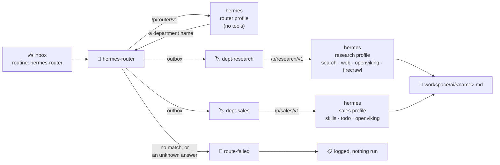

# Routing to Departments

:::info[Mechanism, not a flow]
This is the plumbing under agent work: how a task becomes a *particular* agent's task. If you
are here to see what the system does, start at [Level 3 · Flows](../flows/).
:::

A task arrives with no idea who should handle it. `hermes-router` reads it, names one
department, and writes a decree message addressed to that department's routine. The department
answers with its own tools and files the result in `workspace/ai/`.



## Why route at all

A hermes profile is its own `HERMES_HOME`: its own `config.yaml`, `.env`, `SOUL.md` and
`skills/`. With `GATEWAY_MULTIPLEX_PROFILES` set, every profile is served off the one listener
at `/p/<name>/v1`, so a caller picks a profile — and therefore a toolset and an MCP server list
— by URL alone.

That matters because tool schemas are the expensive axis of a hermes prompt. Measured on this
stack:

| Profile | Fixed prompt | Tools |
|---|---|---|
| default | ~69 KB (~17,000 tokens) | 21 |
| research | ~15 KB | 4 toolsets + firecrawl |
| sales | ~15 KB | 2 toolsets |
| router | ~2.6 KB (~650 tokens) | 0 |

A skill costs about 76 bytes in the always-on index; a tool schema costs about 2.4 KB. So the
lever is *tools*, not agents — a department can hold thirty agents for the price of one tool.
Routing on the tool-free profile is what makes it cheap enough to run on every message.

## Adding a department

A department is one file in `automations/shared_routines/`:

```bash
#!/usr/bin/env bash
# Department: legal
#
# DEPT_DESCRIPTION: Contracts, terms, licensing questions, and compliance review.
# DEPT_TOOLSETS: skills, todo
# DEPT_MCP: openviking
set -euo pipefail
SCRIPT_DIR="$(cd "$(dirname "${BASH_SOURCE[0]}")" && pwd)"
# ... precheck block, copied from dept-sales.sh ...
DEPT_PROFILE="legal"
source "${SCRIPT_DIR}/../lib/hermes-dept.sh"
dept_run
```

Those three header lines are the whole registration. `hermes-router` reads `DEPT_DESCRIPTION`
out of every `dept-*.sh` to build the list it chooses from, and
`./existential.sh run hermes profiles` reads all three to create the matching hermes profile.
Nothing else changes — no registry, no router edit.

Then:

1. Add `dept-legal: {enabled: true}` to `services/decree/decree/config.exist.yml`. Shared
   routines are invisible until they are listed.
2. `./existential.sh && docker compose up -d`
3. `./existential.sh run hermes profiles` — creates `profiles/legal/` with the toolsets and MCP
   servers the header named, inheriting the model from your default profile.

Write `DEPT_DESCRIPTION` as the answer to *"when should work come here?"*. It is the only thing
the router sees, so a vague one produces vague routing.

## Provisioning the profiles

```
./existential.sh run hermes profiles
```

Idempotent and never destructive: an existing profile keeps its `config.yaml`. To rebuild one
after changing its header, delete `volumes/hermes_agent_data/profiles/<name>` and run it again.

Each profile gets its own `API_SERVER_KEY`. Secondary profiles do not borrow the default
profile's credential — a profile without one returns 401 on every request, and an unknown
profile name returns 404 rather than quietly falling through to the default.

To see what a profile costs:

```
docker exec -e HERMES_HOME=/opt/data/profiles/research hermes-agent \
  /opt/hermes/.venv/bin/hermes prompt-size
```

## Sending work

Drop a message in `services/decree/decree/inbox/`:

```
---
routine: hermes-router
source_file: notes/competitors.md
output_name: competitor-scan
---

Find out who already sells this, and how they position against each other.
```

Or skip the router and address a department directly with `routine: dept-research` — the same
routine, no routing call. A file processor does this by writing the outbox message itself; see
[File Processor](./file-change-processing).

## When routing fails

`hermes-router` never guesses. The reply is validated against the discovered department list,
and anything else — an empty answer, a gateway timeout, a hallucinated name, or an honest
`none` — routes to `route-failed`, which logs what happened and stops:

```
FAILED TO ROUTE to 'none'
  reason     : the router found no department matching this message
  candidates : research sales
  source     : test/weather.md
Nothing was run for this message.
```

`route-failed` calls no model and runs no agent. It is also decree's `default_routine`, so a
message that arrives with no routine at all lands here rather than at `develop`, which has
terminal and file-write access.

## Why not OpenCode

Departments call the hermes endpoint directly rather than going through OpenCode. Hermes is
itself an agent running its own tool loop against its own MCP servers, so OpenCode would be an
agent wrapping an agent — and OpenCode's streaming parser rejects hermes' custom
`event: hermes.tool.progress` SSE frames outright, which fails every turn where hermes actually
uses a tool. Coding work that genuinely wants a repo-editing agent still goes to `develop`.
