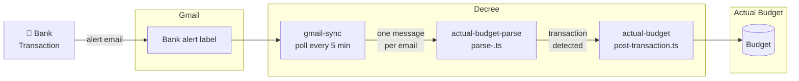

# Bank Alert → Gmail → Budget

Automatically imports transaction alert emails into Actual Budget. A cron job polls a Gmail label every 5 minutes, routes matching emails through a bank-specific parser, and posts any transactions it finds to your Actual Budget account.



## Bank & Gmail Prerequisites

Before running any setup commands, the email pipeline needs two things in place on the bank and Gmail side.

### 1. Enable transaction alerts at your bank

Most banks let you configure email alerts for every transaction — check your bank's notification or alert settings. Enable alerts for **all transactions** (not just large ones), and make sure they go to your Gmail address. Some banks call this "transaction notifications," "spending alerts," or "purchase alerts."

Not all banks support per-transaction email alerts. If yours doesn't, this flow won't work for that account.

### 2. Create a Gmail label for those alerts

Once alerts are arriving, set up a Gmail filter to label them automatically:

1. Open a transaction alert email in Gmail
2. Click the three-dot menu → **Filter messages like these**
3. Use the sender address (e.g. `no.reply.alerts@chase.com`) as the filter condition
4. Choose **Apply the label** → create a new label (e.g. `Chase/Transaction`)
5. Check **Also apply to matching conversations** to catch existing emails

Give each bank its own distinct label — the label is how Decree knows which emails to pick up and which parse script to use.

## How It Works

### 1. Cron trigger

`automations/cron/gmail-transactions-<label>.md` fires the `gmail-sync` routine every 5 minutes. It sets `GMAIL_LABEL_FILTER` to your bank's alert label and `GMAIL_ROUTINE` to `actual-budget-parse`. Fields prefixed `fwd_` are forwarded into each child message — this is how `parse_script` and `account_id` travel down the chain.

### 2. gmail-sync

Fetches any new emails from the label using Gmail's History API (incremental — only emails since the last run). Each email is written as a markdown file to the Decree outbox with `routine: actual-budget-parse` in the frontmatter.

### 3. actual-budget-parse

Runs a bank-specific `parse-<bank>.ts` script against the email. The parser reads the subject line and outputs a transaction JSON object. If a transaction is found, it writes a new outbox message targeting `actual-budget`. If the email isn't a transaction alert, the message is discarded silently.

### 4. actual-budget

Calls `post-transaction.ts` using `@actual-app/api` to post the transaction to your Actual Budget server. Reads credentials from `/secrets/actual-budget/credentials.env` and the account ID from the message frontmatter.

## Setup

Run these steps in order. Each builds on the previous one.

### Step 1 — Gmail OAuth

If you haven't already authorized Gmail access:

```bash
./existential.sh setup gmail
```

This grants Decree read-only Gmail access and automatically saves your label list to `/secrets/gmail/labels.json`. See [Gmail](../integrations/gmail) for full instructions.

If you've already set up Gmail but need to refresh the label cache (e.g. you added a new label):

```bash
./existential.sh setup gmail-labels
```

### Step 2 — Actual Budget credentials

```bash
./existential.sh setup actual-budget
```

Connect to your Actual Budget server, select a budget, and save credentials. At the end, the script prints all your accounts with their IDs and saves them to `/secrets/actual-budget/accounts.json` for use in the next step.

See [Actual Budget](../integrations/actual-budget) for full instructions.

### Step 3 — Create the cron

```bash
./existential.sh setup gmail-transactions-cron
```

An interactive prompt will:

1. List your custom Gmail labels — select the one your bank sends alerts to
2. List available parse scripts — select the one matching your bank
3. List your open Actual Budget accounts — select the one to post transactions to
4. Confirm the schedule (default: `*/5 * * * *`)
5. Write `automations/cron/gmail-transactions-<label>.md`

No restart needed — Decree picks up new cron files on the next tick.

## Verifying

Check that the routines are registered and passing pre-checks:

```bash
docker exec decree decree routine actual-budget-parse
docker exec decree decree routine actual-budget
```

Watch the next cron fire and inspect the run log:

```bash
docker exec decree decree status
docker exec decree decree log <id-prefix>
```

To test immediately without waiting for the cron, drop a message manually:

```bash
cat > automations/inbox/test-transaction.md << 'EOF'
---
routine: actual-budget-parse
subject: 'You made a $42.00 transaction with WHOLE FOODS'
date: 'Mon, 21 Apr 2026 12:00:00 +0000 (UTC)'
parse_script: /work/.decree/lib/actual-budget/parse-chase.ts
account_id: <your-account-id>
---
EOF
```

## Adding More Banks

Each bank gets its own parse script. `actual-budget-parse` accepts any `parse_script` that reads the decree message env vars and outputs JSON:

```json
{ "amount": "-42.00", "payee": "Whole Foods", "date": "2026-04-21", "notes": "..." }
```

To add a new bank:

1. Create `automations/lib/actual-budget/parse-<bank>.ts` following the same interface as `parse-chase.ts`
2. Run `./existential.sh setup gmail-transactions-cron` again — it will discover the new script automatically
