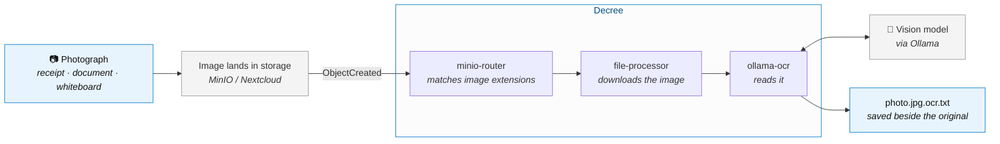

# Camera → OCR

Photograph a receipt, a document, a whiteboard, a page of handwriting — and get its text
back, filed next to the image, without opening anything.

The flow is **image lands in storage → text comes out beside it.** How the photo gets into
storage is a detail you choose; the OCR half is the same either way.



The text lands as a sibling file, so the image and its contents stay together and both get
picked up by whatever indexes that folder next:

```
receipts/2026-08-14_grocery.jpg
receipts/2026-08-14_grocery.jpg.ocr.txt   ← created automatically
```

## Getting the photo in

Anything that writes to a watched bucket triggers the flow. Pick whichever you'll actually
use — the OCR pipeline does not care which one you chose, and you can run several at once.

| Route | Good for | Setup |
|---|---|---|
| **Nextcloud auto-upload** | The default. Your phone's camera roll syncs, and every photo is OCR'd. No bot, no token. | Point the Nextcloud mobile app's auto-upload at a folder backed by MinIO |
| **A Telegram bot** | Deliberate capture — you choose what gets sent, rather than everything you photograph | [Option B](#option-b--telegram-bot) |
| **rclone / a script** | Scanners, batch imports, anything already on disk | `rclone copyto file.jpg minio:bucket/path.jpg` |
| **Any S3 client** | Other apps writing to the bucket directly | Nothing — the bucket event is the trigger |

:::tip[Start with auto-upload]
If you already run Nextcloud, camera auto-upload is the shortest path to this flow working:
photograph something, and the text exists a few seconds later. The Telegram route is
worth it when you want a *deliberate* inbox rather than your whole camera roll.
:::

## How It Works

### 1. The image lands in a watched bucket

However it got there — camera sync, a bot, rclone, another app — the flow starts the moment
the object exists. Nothing polls the image itself.

### 2. MinIO fires the webhook

When the image file lands in MinIO, an `ObjectCreated` event is POSTed to the Decree webhook endpoint. This is the same pipeline used for any file arriving in a watched bucket.

### 3. minio-router matches image extensions

`minio-router` scans the `ollama-ocr` processor and reads its pattern:

```bash
PATTERN='\.(jpg|jpeg|png|webp|gif|heic|heif|tiff?|bmp)$'
IS_PRE_SIGNED=false
```

A match enqueues a `file-processor` message with `is_pre_signed: false` — the file will be downloaded locally.

### 4. file-processor downloads the image

`file-processor` runs `rclone copyto` to pull the image into a temp path and exports it as `FILE_PATH`. No pre-signed URL is involved — the full image bytes are needed to encode as base64 for the vision API.

### 5. ollama-ocr extracts the text

`ollama-ocr.sh` invokes `ocr.ts`, which:

1. Reads the image from `FILE_PATH` and encodes it as base64
2. POSTs to `http://ollama:11434/api/generate` with the configured vision model and an extraction prompt
3. Writes the returned text to stdout

The shell processor pipes that output via `rclone rcat` to Nextcloud at the same path with `.ocr.txt` appended:

```
telegram/1745000000_AgADjk.jpg
telegram/1745000000_AgADjk.jpg.ocr.txt   ← created automatically
```

## Prerequisites

- **MinIO** receiving `ObjectCreated` events and forwarding them to the Decree webhook (see [File Processor](../decree/file-change-processing))
- **Nextcloud + MinIO** configured with MinIO as S3 external storage (so images land in both)
- **Ollama** running with a vision-capable model pulled (e.g. `llava`, `llava-phi3`, `moondream`)
- **rclone** configured with a `nextcloud` remote

Nothing on that list is specific to how you take the picture.

## Setup

### Step 1 — Pull a vision model in Ollama

```bash
docker exec ollama ollama pull llava
```

Any Ollama-compatible vision model works. `llava` is a solid general-purpose choice; `llava-phi3` is faster on CPU.

### Step 2 — MinIO webhook and rclone

Follow the MinIO setup in [File Processor](../decree/file-change-processing#minio-setup) to subscribe your image bucket to `ObjectCreated` events, and ensure your rclone `nextcloud` remote is configured:

```bash
./existential.sh run rclone
```

### Step 3 — Point a camera at it

That is the whole OCR pipeline. Now pick how images arrive.

#### Option A — Nextcloud camera auto-upload

In the Nextcloud mobile app, turn on **Auto upload** and target a folder that lives on the
MinIO-backed external storage. Every photo you take syncs up and gets OCR'd. There is nothing
else to configure — the bucket event is the trigger.

#### Option B — Telegram bot

Use this when you want a deliberate inbox instead of your whole camera roll: you photograph
something and *choose* to send it.

Create the bot via [@BotFather](https://t.me/BotFather) with `/newbot` and copy the token, then:

```bash
mkdir -p services/decree/secrets/telegram
cat > services/decree/secrets/telegram/credentials.env << 'EOF'
TELEGRAM_BOT_TOKEN=your-token-here
EOF
```

The secrets directory is bind-mounted into the decree container at `/secrets/telegram/`.

Enable `telegram-ingest` in `automations/config.yml`:

```yaml
shared_routines:
  telegram-ingest:
    enabled: true
```

Copy and activate the example cron:

```bash
cp services/decree/decree/cron.example/telegram-poll.md \
   services/decree/decree/cron/
```

`telegram-ingest` polls `getUpdates` every minute, tracks a cursor in
`/secrets/telegram/offset.txt` so nothing is processed twice, and pipes each new photo through
`rclone rcat` into `TELEGRAM_RCLONE_DEST`. From there it is an ordinary bucket event and the
flow above takes over. Cron frontmatter is read when the daemon starts, so restart it to pick
the new schedule up:

```bash
docker compose restart decree
```

#### Option C — rclone

For scanners, batch imports, or anything already on disk:

```bash
rclone copyto /path/to/scan.jpg minio:documents/scan.jpg \
  --config services/decree/secrets/rclone/rclone.conf
```

## Customization

| Variable | Default | Description |
|---|---|---|
| `TELEGRAM_RCLONE_DEST` | `nextcloud:S3/telegram` | *Telegram route only* — where downloaded images are stored (triggers the OCR pipeline) |
| `FILE_SUFFIX` | `.ocr.txt` | Suffix appended to the image path for the OCR output |
| `OUTPUT_RCLONE` | `nextcloud` | rclone remote where the OCR result is saved |
| `OCR_MODEL` | `llava` | Ollama vision model used for text extraction |
| `OLLAMA_URL` | `http://ollama:11434` | Ollama API base URL |

## Testing

Drop a test image straight into the bucket to bypass whichever capture route you chose and verify the OCR pipeline on its own:

```bash
rclone copyto /path/to/test.jpg nextcloud:S3/telegram/test.jpg \
  --config services/decree/secrets/rclone/rclone.conf
```

Then send a synthetic MinIO event:

```bash
curl -X POST http://localhost:48880/minio \
  -H "Authorization: Bearer <DECREE_MINIO_WEBHOOK_AUTH_TOKEN>" \
  -H "Content-Type: application/json" \
  -d '{"EventName":"s3:ObjectCreated:Put","Key":"telegram/test.jpg","Records":[]}'
```

Watch the run complete:

```bash
docker logs -f decree
docker exec decree decree status
docker exec decree decree log <id-prefix>
```

## Reusing the OCR function

`ocr.ts` is a standalone library importable in any other TypeScript routine:

```typescript
import { ocr } from "/work/.decree/lib/ocr";

const text = await ocr("/tmp/some-file.png", {
  model: "llava-phi3",
  prompt: "What does this receipt total?",
});
```
