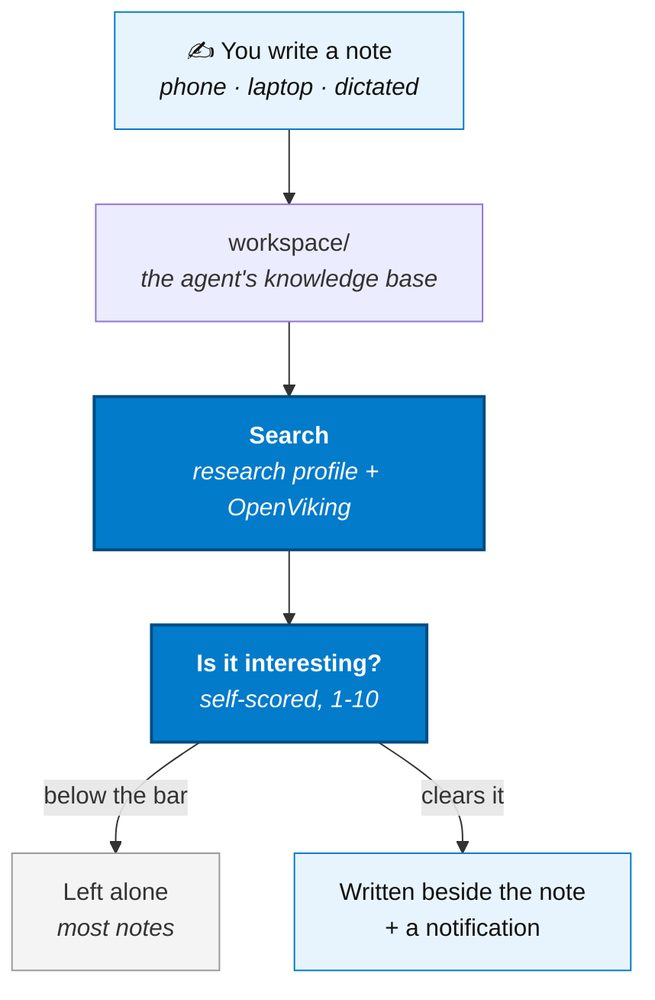

# Note → Connection

The worst part of forgetting something isn't losing it — it's not knowing you did. You write
things down so you don't have to hold them, and then holding onto *that* becomes its own job:
re-reading old notes, hoping the one that matters resurfaces before it's too late.

This flow does that re-reading for you. Every new or changed note gets checked against
everything else you've written down, and if there's a real connection — not a shared topic,
an actual insight — it gets handed back to you before you'd have found it yourself.



## Why this is a different question than triage

[Note → Action](./note-to-action) asks *"is this worth acting on"* — deliberately stingy,
because most notes are a grocery list. This flow asks something narrower of **every** new or
changed note, not just the ones that pass that bar: *"does anything I already know actually
connect to this?"*

A shared topic, project, or person is not enough on its own. "Both mention coffee" is not a
connection — it's noise, and a system that surfaces noise trains you to stop reading it. The
bar is an insight you would not have made just by remembering the earlier note existed.

## The two moves

### 1. Search — not a plain question, a tool

Finding a real connection means actually searching the knowledge base, which is a job for a
tool, not a chat model guessing. So this routine doesn't call the gateway directly the way
[Note → Action](./note-to-action)'s triage step does — it hands the note to a
[Hermes](../ai/hermes) department profile that carries [OpenViking](../ai/openviking) as an
MCP tool (`research`, by default), and lets it search the OpenViking index for itself.

### 2. The gate — self-scored, and strict

The same call that searches also judges. It comes back with either `NONE`, or one candidate
connection and a 1-10 score for how genuinely interesting and non-obvious it is. Only a score
at or above `CONNECT_MIN_SCORE` (7 by default) gets written down and sent to you — everything
else is silence, on purpose. The flow only earns your trust by being right often enough that
you stop needing to double-check it yourself.

The same pairing is never surfaced twice. Edit the note again later and a *different*
connection can still come through — just not the one you already saw.

## It ships with Core

Unlike every other flow on this page, there is no quest to pick. `./existential.sh quest` →
**Core** copies `note-connect.md` into `automation/cron/` for you, alongside the cron that
indexes `workspace/` into OpenViking in the first place — the same `requires:` gate, since one
is pointless without the other. Nothing else to enable: `note-connect` is on by default in
`services/automation/decree/config.yml`, and `NOTES_DIR` defaults to `/workspace`, the same
tree [Hermes](../ai/hermes) already reads and [OpenViking](../ai/openviking) already indexes.

**Opting out is a file deletion, nothing more:**

```bash
rm automation/cron/note-connect.md
docker compose restart automation
```

`enabled: true` with no cron file behind it never fires — there's no config flag to also flip.
Delete the file, and it's gone until you copy it back from `automation-examples/cron/`.

Running a custom, non-Core install instead? Copy that same file yourself:

```bash
cp automation-examples/cron/note-connect.md automation/cron/
docker compose restart automation
```

### Pointing it at a different vault

`NOTES_DIR` defaulting to `/workspace` is what makes this need nothing beyond Hermes and
OpenViking. If you run [Note → Action](./note-to-action)'s note-triage vault mirror and would
rather scan that instead, set `NOTES_DIR: "/data/notes"` in the cron frontmatter — everything
else about the flow is unchanged.

### Check it before trusting it

```bash
docker exec automation decree routine note-connect       # the routine's own pre-check
printf -- '---\nroutine: note-connect\nCONNECT_DRY_RUN: true\n---\n' > automation/inbox/dry-run.md
```

A dry run logs every candidate and score, and writes nothing — including no ledger entry, so
tuning `CONNECT_MIN_SCORE` never poisons the "already surfaced" check.

:::warning[The first run does nothing, on purpose]
Same reason as [Note → Action](./note-to-action#4-restart-then-watch-it-do-nothing): it
records the tree as seen *without* scanning it — turning this on over an already-full
`workspace/` should not fire a call per file. To scan the backlog once:

```bash
printf -- '---\nroutine: note-connect\nCONNECT_BOOTSTRAP: true\n---\n' > automation/inbox/bootstrap.md
```
:::

### Prerequisites

- `workspace/` actually indexed — this is where "something you already know" comes from. On by
  default once [OpenViking](../ai/openviking) is enabled, which Core enables
- [Hermes](../ai/hermes) running with the `research` profile provisioned — `ai/hermes/entrypoint.sh`
  does this automatically on boot from `ai/hermes/profiles/research/`; restart `hermes-agent`
  if you enabled Hermes before OpenViking

## Settings reference

| Setting | Default | Does |
|---|---|---|
| `CONNECT_MIN_SCORE` | `7` | **The judgment.** How interesting a connection has to be, 1-10 |
| `CONNECT_PROFILE` | `research` | Which hermes profile searches — needs `mcp: openviking` |
| `CONNECT_DRY_RUN` | `false` | Log every candidate and score, write nothing, notify no one |
| `CONNECT_LEDGER` | `true` | The same source-to-target pairing is never surfaced twice |
| `CONNECT_MAX_NOTES` | `20` | Ceiling per run |
| `CONNECT_MIN_CHARS` | `120` | Below this a note is skipped without a model call |
| `CONNECT_MAX_CHARS` | `6000` | Note text is truncated to this many characters before searching |
| `CONNECT_MODEL` | *(profile default)* | Pin a specific model |
| `CONNECT_TIMEOUT` | `300` | Seconds for the department call before it's treated as no answer |
| `CONNECT_API_KEY` | *(falls back to `HERMES_API_KEY`)* | Override the gateway credential |
| `CONNECT_NOTIFY` | `true` | Send an ntfy notification when a connection is surfaced |
| `CONNECT_OUTPUT_RCLONE_DEST` | *(unset)* | Where the writeup is copied, e.g. `nextcloud:Notes` |

All of it is cron frontmatter. No code changes.

:::warning[Don't point the output back into NOTES_DIR]
Output lands in `/data/note-connect/output`, deliberately outside whichever tree `NOTES_DIR`
scans — writing a `.connection.md` file back into `/workspace` would make the next run treat
its own output as a new note. If you set `CONNECT_OUTPUT_RCLONE_DEST`, point it at a vault
folder, not at `workspace/` or (if you switched `NOTES_DIR`) `/data/notes` — the latter is also
an rclone **sync** cache, so anything written there is deleted on the next sync regardless.
:::

## What ships and what you write

| Part | Status |
|---|---|
| Vault diff — detecting new and changed notes | **Ships.** Hashes the vault and diffs against the last run, same mechanism as Note → Action |
| Searching the knowledge base | **Ships.** The `research` hermes profile, with OpenViking as an MCP tool |
| Scoring and the relevance gate | **Ships.** One self-scored call; only scores at or above `CONNECT_MIN_SCORE` surface |
| Not repeating the same pairing | **Ships.** A plain ledger at `/data/note-connect/connections.tsv` |
| Writing the result beside the note | **Ships.** `<note>.connection.md`, copied over rclone when configured |
| Notifying you | **Ships.** `notify` → ntfy |
| **How interesting is interesting enough** | **Yours.** `CONNECT_MIN_SCORE` — the whole point of the flow |
