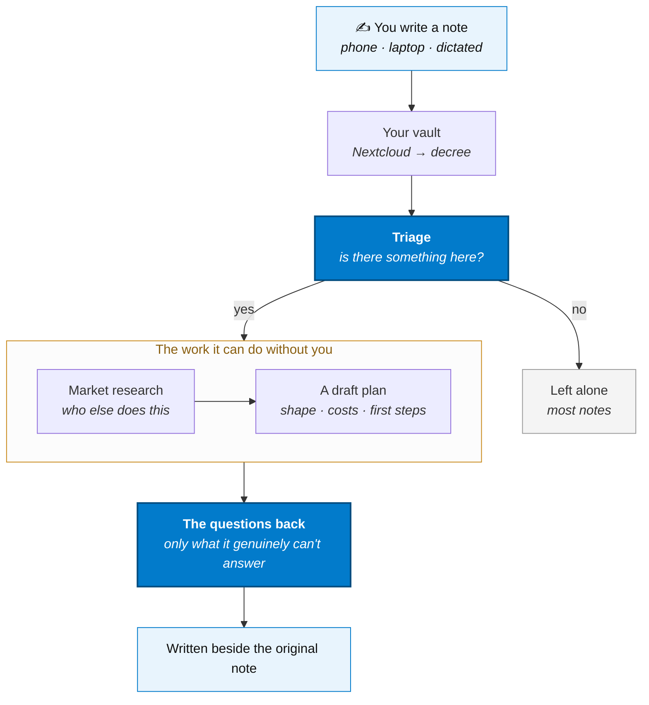

# Note → Action

You write things down and then never come back to them. This flow is the one that comes back
to them for you.

Notes land in your vault the way they always do. Something reads each new one, decides whether
it is *worth acting on*, and if it is, does the work it can do unattended — then hands you back
the part only you can answer.

The worked example here is **a business idea**, because it is the case where the gap between
"I had a thought" and "I know whether it's any good" is widest. The shape is the same for any
kind of note you want chased down.



## The four moves

### 1. Notes arrive

Nothing changes about how you capture. You write in your editor, on your phone, or by talking
at it — it syncs to Nextcloud like it already does. The `notes` routine pulls the vault down
and compiles it into per-directory markdown with an index, which is the form a model can
actually read without being handed forty thousand files.

### 2. Triage — is there anything here?

This is the step that makes the flow worth having, and the step that has to be *stingy*. Most
notes are a grocery list or a meeting time. `note-triage` asks the gateway one cheap question
per new note: **is there a real idea in this, or not?**

Only new and changed notes are considered — the routine hashes the vault each run and diffs
against the last one, so a note is judged when you write it and again when you meaningfully
edit it, never on a loop.

Being conservative here is the whole game. A triage step that fires on everything produces a
folder of unread reports, which is the problem you started with.

### 3. Do what can be done unattended

Only for the notes that passed. The routine chains follow-up work — each step is another
message in the same queue, so a long job is just a sequence of small ones and you can watch it
progress:

- **Market research** — who is already doing this, what they charge, where the gap is.
  [Firecrawl](../ai/firecrawl) turns the pages it finds into something the model can read.
- **A draft plan** — the shape of the thing, rough costs, what would have to be true for it to
  work, and the first three steps.
- **What's already yours** — whether anything else in your vault bears on it. Your own past
  notes are the context no external tool has.

### 4. Come back with the right questions

The output is not a report you have to read. It is **the two or three things the work could not
resolve** — the questions where your answer changes the conclusion:

> *You'd need to know whether the licensing applies to resale — do you? And is this a weekend
> project or the thing you leave your job for? The plan branches hard on that one.*

Those get written beside the original note, so the answer lands where the thought started.
Answer them and the next run picks up from there.

:::tip[Why the questions matter more than the plan]
An AI can produce a plausible business plan for anything. What it cannot do is know which
assumption you are actually uncertain about. Ending on the open questions is what keeps this
from being a machine for generating documents nobody reads.
:::

## Setting it up

It ships as two routines and one quest.

```bash
./existential.sh quest      # pick "Note Triage"
```

That copies the hourly cron template into place. Then enable both routines in
`services/decree/decree/config.yml` and restart:

```yaml
note-triage:
  enabled: true
note-develop:
  enabled: true
```

```bash
docker compose restart decree
```

:::warning[The first run does nothing, on purpose]
It records your vault as seen *without* triaging. Turning this on with a 5,000-note vault
should not fire 5,000 model calls. To scan the backlog once:

```bash
docker exec decree decree run --routine note-triage --param TRIAGE_BOOTSTRAP=true
```
:::

### Prerequisites

- Notes landing in `/data/notes` — activate the **Notes Sync** quest, or point `NOTES_DIR` at
  a vault you already sync
- [Hermes](../ai/hermes) running, or set `TRIAGE_API_URL=http://ollama:11434/v1` to talk to
  [Ollama](../ai/ollama) directly

## Making it yours

Everything here is cron frontmatter — no code changes. These are the two that matter:

| Setting | Why you'd touch it |
|---|---|
| **`TRIAGE_CRITERIA`** | **This is the feature.** It ships looking for a business idea; point it at research questions, writing prompts, house projects — whatever you want chased down. |
| **`TRIAGE_DRY_RUN`** | Log what it *would* flag and chain nothing. Run it this way for a few days first. |

And the rest:

| Setting | Default | Does |
|---|---|---|
| `TRIAGE_ROUTINE` | `note-develop` | What to chain on a pass. Swap in your own and the triage half still works |
| `TRIAGE_MAX_NOTES` | `20` | Ceiling per run, so a big import can't run away with your GPU |
| `TRIAGE_MIN_CHARS` | `120` | Below this a note is skipped without a model call |
| `TRIAGE_MODEL` | *(gateway default)* | Pin a specific model |
| `NOTE_OUTPUT_RCLONE_DEST` | *(unset)* | Where the draft is copied so it lands beside the original, e.g. `nextcloud:Notes` |
| `FIRECRAWL_URL` | *(unset)* | Set to `http://firecrawl:3002` to research before drafting |

:::warning[Don't point the output at your vault cache]
`/data/notes` is an rclone **sync** cache — it is made to match Nextcloud on every `notes`
run, so anything written there is deleted. That is why drafts land in
`/data/note-triage/output` and are copied back to the vault over rclone instead.
:::

## What ships and what you write

Being straight about the line, since this flow sits closer to the frontier than the others.

| Part | Status |
|---|---|
| Vault sync and compilation | **Ships.** The `notes` routine |
| Detecting new and changed notes | **Ships.** `note-triage` hashes the vault and diffs against the last run |
| The triage call and the chain | **Ships.** `note-triage` → outbox message → `note-develop` |
| Research, draft, open questions | **Ships.** `note-develop`, with [Firecrawl](../ai/firecrawl) research when configured |
| Indexing notes for retrieval | **Ships.** [OpenViking](../ai/openviking) watches directories and keeps them queryable |
| Notifying you | **Ships.** `notify` → ntfy, or `telegram-notify` |
| **What counts as worth acting on** | **Yours.** One line of prompt, and the whole point of the flow |

The judgment is deliberately a setting rather than a decision made for you — what counts as an
idea worth chasing is specific to you, and a stock answer would get it wrong in a way that is
worse than not running at all.

## If it fires too often

That is the expected first failure, and the fix is always the same: make `TRIAGE_CRITERIA`
narrower and more concrete. "A business idea" is vague; "a product someone would pay for that
I could build a first version of in a month" is not. Run with `TRIAGE_DRY_RUN=true` while you
tune it — the log shows every verdict without chaining any work.
