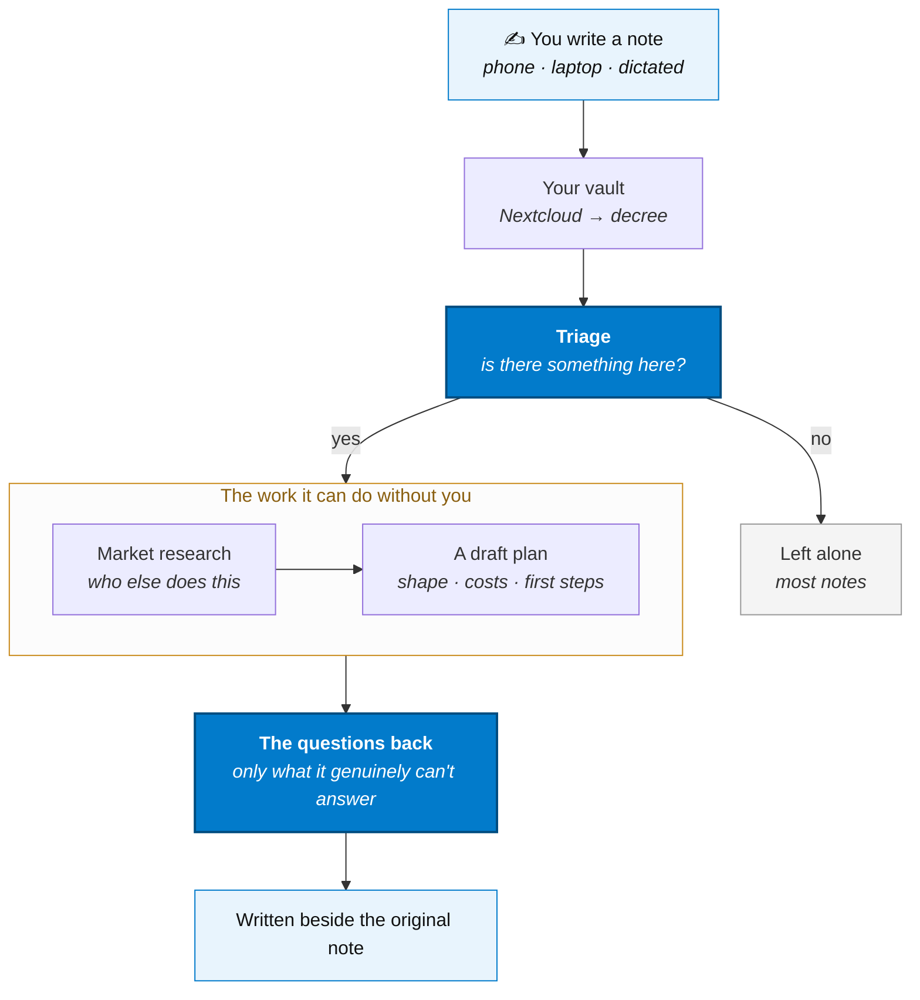

# Note → Action

You write things down and then never come back to them. This flow is the one that comes back
to them for you.

Notes land in your vault the way they always do. Something reads each new one, decides whether
it is *worth acting on*, and if it is, does the work it can do unattended — then hands you back
the part only you can answer.

The worked example here is **a business idea**, because it is the case where the gap between
"I had a thought" and "I know whether it's any good" is widest. The shape is the same for any
kind of note you want chased down.



## The four moves

### 1. Notes arrive

Nothing changes about how you capture. You write in your editor, on your phone, or by talking
at it — it syncs to Nextcloud like it already does. The `notes` routine pulls the vault down
and compiles it into per-directory markdown with an index, which is the form a model can
actually read without being handed forty thousand files.

### 2. Triage — is there anything here?

This is the step that makes the flow worth having, and the step that has to be *stingy*. Most
notes are a grocery list or a meeting time. `note-triage` asks the gateway one cheap question
per new note: **is there a real idea in this, or not?**

Only new and changed notes are considered — the routine hashes the vault each run and diffs
against the last one, so a note is judged when you write it and again when you meaningfully
edit it, never on a loop.

Being conservative here is the whole game. A triage step that fires on everything produces a
folder of unread reports, which is the problem you started with.

### 3. Do what can be done unattended

Only for the notes that passed. The routine chains follow-up work — each step is another
message in the same queue, so a long job is just a sequence of small ones and you can watch it
progress:

- **Market research** — who is already doing this, what they charge, where the gap is.
  [Firecrawl](../ai/firecrawl) turns the pages it finds into something the model can read.
- **A draft plan** — the shape of the thing, rough costs, what would have to be true for it to
  work, and the first three steps.
- **What's already yours** — whether anything else in your vault bears on it. Your own past
  notes are the context no external tool has.

### 4. Come back with the right questions

The output is not a report you have to read. It is **the two or three things the work could not
resolve** — the questions where your answer changes the conclusion:

> *You'd need to know whether the licensing applies to resale — do you? And is this a weekend
> project or the thing you leave your job for? The plan branches hard on that one.*

Those get written beside the original note, so the answer lands where the thought started.
Answer them and the next run picks up from there.

:::tip[Why the questions matter more than the plan]
An AI can produce a plausible business plan for anything. What it cannot do is know which
assumption you are actually uncertain about. Ending on the open questions is what keeps this
from being a machine for generating documents nobody reads.
:::

## The four routines

The flow is four routines and one cron file. Nothing else — and each one is replaceable on its
own, which is the part worth understanding.

| Routine | Does | Swap it when |
|---|---|---|
| `notes` | Pulls the vault down from Nextcloud into `/data/notes` | Your notes live somewhere else |
| `note-triage` | Diffs the vault, judges each new note, checks it against the ledger, chains the next step | Never — this is the spine |
| `note-develop` | *(default)* Researches and drafts one document | You want the fan-out instead |
| `idea-workup` | *(alternative)* Hands the idea to three hermes departments | You want one document instead |

## Setting it up, step by step

### 1. Pick the quest

```bash
./existential.sh quest      # pick "Note Triage"
```

That copies `note-triage.md` from `cron.example/` into `cron/`. It does not enable anything
yet — a routine on disk is invisible until it is listed.

### 2. Enable the routines

In `services/automation/decree/config.yml`:

```yaml
note-triage:
  enabled: true
note-develop:
  enabled: true
```

Or, for the department fan-out described below, these instead:

```yaml
note-triage:
  enabled: true
idea-workup:
  enabled: true
hermes-dept:
  enabled: true
```

:::info[Why edit `config.yml` and not `config.exist.yml`]
`config.exist.yml` is the tracked template; `config.yml` is what your daemon actually reads and
is gitignored, so it is yours to edit. A rendered file is never re-rendered.
:::

### 3. Confirm the hermes profiles exist — fan-out path only

```bash
docker exec hermes-agent ls /opt/data/profiles
```

`ai/hermes/entrypoint.sh` provisions every profile in `ai/hermes/profiles/` on boot, so
`research` and `sales` should already be there; if not, `docker compose up -d hermes-agent`.
Each department is served at `/p/<name>/v1` with its own tools and its own API key — a profile
does not borrow the default profile's credential, so an unprovisioned one returns 401.

### 4. Restart, then watch it do nothing

```bash
docker compose restart automation
```

:::warning[The first run does nothing, on purpose]
It records your vault as seen *without* triaging. Turning this on with a 5,000-note vault
should not fire 5,000 model calls. To scan the backlog once:

```bash
printf -- '---\nroutine: note-triage\nTRIAGE_BOOTSTRAP: true\n---\n' > automation/inbox/bootstrap.md
```
:::

### 5. Check it before trusting it

```bash
docker exec automation decree routine note-triage       # the routine's own pre-check
printf -- '---\nroutine: note-triage\nTRIAGE_DRY_RUN: true\n---\n' > automation/inbox/dry-run.md
```

A dry run prints a verdict per note and chains nothing. Read a few days of that output before
you let it queue real work — and note that a dry run never writes to the ledger, so tuning the
criteria cannot poison the "is this new?" check.

### Prerequisites

- Notes landing in `/data/notes` — activate the **Notes Sync** quest, or point `NOTES_DIR` at a
  vault you already sync
- [Hermes](../ai/hermes) running, or set `TRIAGE_API_URL=http://ollama:11434/v1` to talk to
  [Ollama](../ai/ollama) directly (triage and dedupe work fine this way; the departments do not
  — they *are* hermes profiles)

## Swap the judgment

`TRIAGE_CRITERIA` is one line of cron frontmatter and it is the entire feature:

```yaml
TRIAGE_CRITERIA: "a business idea — something the author could plausibly build, sell, or start"
```

Point it at research questions, writing prompts, house projects, anything. This is the setting
that decides what the flow is *for*.

If it fires too often — the expected first failure — the fix is always to make it narrower and
more concrete. "A business idea" is vague; "a product someone would pay for that I could build
a first version of in a month" is not.

## Is it new? The idea ledger

A good idea gets written down more than once. Triage keeps an append-only ledger at
`/data/note-triage/ideas.tsv` — one line per idea it has already put through, in the words it
used to summarize it. When a note passes the criteria, one more cheap call asks whether it is
materially the same as something on that list. Duplicates stop there.

```
2026-08-14T09:11:04Z	A tool-rental service for the neighborhood, booked from a phone
2026-08-22T17:40:55Z	A newsletter that summarizes local council minutes
```

The ledger is plain TSV — read it, prune it, or delete a line to let an idea through again.

| Setting | Default | Does |
|---|---|---|
| `TRIAGE_LEDGER` | `true` | Set `false` to chain every pass, duplicates included |
| `TRIAGE_LEDGER_MAX` | `100` | How many past ideas the check sees, most recent first |

It **fails open**: a gateway blip or an unparseable answer means "new". A duplicate workup
wastes a run; a dropped one loses the idea for good.

## Swap the work

`TRIAGE_ROUTINE` names what gets chained when a note passes. Two ship.

### `note-develop` — one document

The default. One call, one file: what the idea is, what can be worked out, and the two-to-four
questions only you can answer. Works with nothing but a chat model — no profiles, no
departments. Output lands in `/data/note-triage/output`, and is copied beside the original note
when `NOTE_OUTPUT_RCLONE_DEST` is set.

### `idea-workup` — three departments, three answers

```yaml
TRIAGE_ROUTINE: idea-workup
```

This one does no model work itself. It writes **three outbox messages**, each addressed to the
department whose hermes profile owns the right tools:

| Question | Department | Why that profile |
|---|---|---|
| Who else is already doing this? | `research` | The only department with web access — `search`, `web`, plus Firecrawl and OpenViking |
| How big is the market? | `research` | Same tools; a separate message so it lands as its own document |
| What is my value proposition? | `sales` | Owns pricing, positioning and customer-facing writing |

Each answer arrives as its own file in `workspace/ai/`:

```
workspace/ai/tool-rental-competition.md
workspace/ai/tool-rental-tam.md
workspace/ai/tool-rental-value-prop.md
```

with its own ntfy notification, so you can read the competition answer while the market sizing
is still running.

:::info[Why three messages and not one prompt]
A profile's cost is its tool schemas — the default hermes profile carries every tool at roughly
40,000 prompt tokens per call, while a narrow one costs a fraction of that. Sending each
question to the department that already has the right tools is cheaper *and* better answered
than one agent holding everything. It also means each question retries, logs and appears in
Grafana on its own. See [Routing to Departments](../decree/routing).
:::

### Writing a third one

`TRIAGE_ROUTINE` is just a routine name. Write your own, list it in `config.yml`, and point
the cron file at it — the triage half never changes. It receives `note_path` and `note_reason`
as environment variables. [Writing a Routine](../writing-a-routine) is the full contract.

## Swap the input

Nothing above cares that the trigger was a cron scan of a notes vault. Triage takes text and a
name; every input below reduces to the same message. **Only the first step changes.**

```
<anything> ──▶ message ──▶ note-triage ──▶ ledger ──▶ idea-workup ──▶ departments
```

### Email

`gmail-sync` polls Gmail on a cron and archives messages into `automation/emails/` (the
`EMAILS_DIR` default, `/work/.decree/emails` inside the container — `automation/` at the repo
root is the main daemon's whole project dir). Point `NOTES_DIR` at that directory and the same
triage runs over your inbox — the criteria becomes "a customer complaint worth escalating" or
whatever you actually want caught. See [Gmail](../integrations/gmail).

### A file you dropped somewhere

Anything written through MinIO fires an object event → the webhook → `minio-router`, which
matches your **file processor** on a path regex and an optional content gate:

```bash
PATTERN="nextcloud:S3/workspace/.*\.md$"
CRITERIA="a business idea"
```

The processor writes an outbox message and triage takes it from there. No restart — the router
reads the processor directory per event. See
[File Change Processing](../decree/file-change-processing).

### A sensor, or something you said out loud

Home Assistant does not get read by this stack — it reaches out. An automation POSTs the decree
webhook, which turns the request body into an inbox message. A doorbell, a temperature
threshold, or a voice command all arrive the same way. The
[HAwake](./hawake-homeassistant) flow is the worked example.

### A message on your phone

`telegram-ingest` polls a bot for new messages and `rclone`s attachments into storage — where,
being an object write, they become the file trigger above. See
[Telegram](../integrations/telegram).

## Cost and pacing

Decree runs one message at a time, and the department timeout (`AGENT_TIMEOUT`) defaults to 900
seconds. A three-question fan-out can therefore take the better part of an hour. It is not
stuck — check `automation/runs/` or the Grafana **Decree Overview** dashboard, where each
question appears as its own run.

The per-note cost of triage itself is deliberately small: one short call to judge, one more to
check the ledger, and only for notes that are new or changed since the last run and longer than
`TRIAGE_MIN_CHARS`. `TRIAGE_MAX_NOTES` caps how many are examined per run so an import cannot
run away with your GPU.

## Settings reference

| Setting | Default | Does |
|---|---|---|
| `TRIAGE_CRITERIA` | *a business idea* | **The judgment.** The whole point of the flow |
| `TRIAGE_ROUTINE` | `note-develop` | What to chain on a pass — `idea-workup`, or your own |
| `TRIAGE_DRY_RUN` | `false` | Log every verdict, chain nothing, write no ledger entries |
| `TRIAGE_LEDGER` | `true` | The "is this idea new?" check |
| `TRIAGE_LEDGER_MAX` | `100` | How many past ideas that check sees |
| `TRIAGE_MAX_NOTES` | `20` | Ceiling per run |
| `TRIAGE_MIN_CHARS` | `120` | Below this a note is skipped without a model call |
| `TRIAGE_MAX_CHARS` | `6000` | Note text is truncated to this many characters before judging |
| `TRIAGE_MODEL` | *(gateway default)* | Pin a specific model |
| `TRIAGE_API_URL` | `http://hermes-agent:8642/v1` | Point at Ollama to skip hermes for triage |
| `TRIAGE_TIMEOUT` | `120` | Seconds per model call before it's treated as no verdict |
| `TRIAGE_API_KEY` | *(falls back to `HERMES_API_KEY`)* | Override the gateway credential |
| `NOTE_OUTPUT_RCLONE_DEST` | *(unset)* | Where `note-develop`'s draft is copied, e.g. `nextcloud:Notes` |
| `FIRECRAWL_URL` | *(unset)* | Set to `http://firecrawl:3002` for `note-develop` web research |

All of it is cron frontmatter. No code changes.

:::warning[Don't point the output at your vault cache]
`/data/notes` is an rclone **sync** cache — it is made to match Nextcloud on every `notes` run,
so anything written there is deleted. That is why drafts land in `/data/note-triage/output` and
are copied back to the vault over rclone instead.
:::

## What ships and what you write

| Part | Status |
|---|---|
| Vault sync and compilation | **Ships.** The `notes` routine |
| Detecting new and changed notes | **Ships.** `note-triage` hashes the vault and diffs against the last run |
| The triage call and the chain | **Ships.** `note-triage` → outbox message → next routine |
| Knowing an idea is already evaluated | **Ships.** The ledger at `/data/note-triage/ideas.tsv` |
| Research, draft, open questions | **Ships.** `note-develop`, with [Firecrawl](../ai/firecrawl) research when configured |
| Competition, market size, value proposition | **Ships.** `idea-workup` → `hermes-dept` (research and sales) |
| Indexing notes for retrieval | **Ships.** A decree cron uploads `workspace/` into [OpenViking](../ai/openviking) every 15 minutes and keeps it queryable |
| Notifying you | **Ships.** `notify` → ntfy, or `telegram-notify` |
| **What counts as worth acting on** | **Yours.** One line of prompt, and the whole point of the flow |

The judgment is deliberately a setting rather than a decision made for you — what counts as an
idea worth chasing is specific to you, and a stock answer would get it wrong in a way that is
worse than not running at all.
