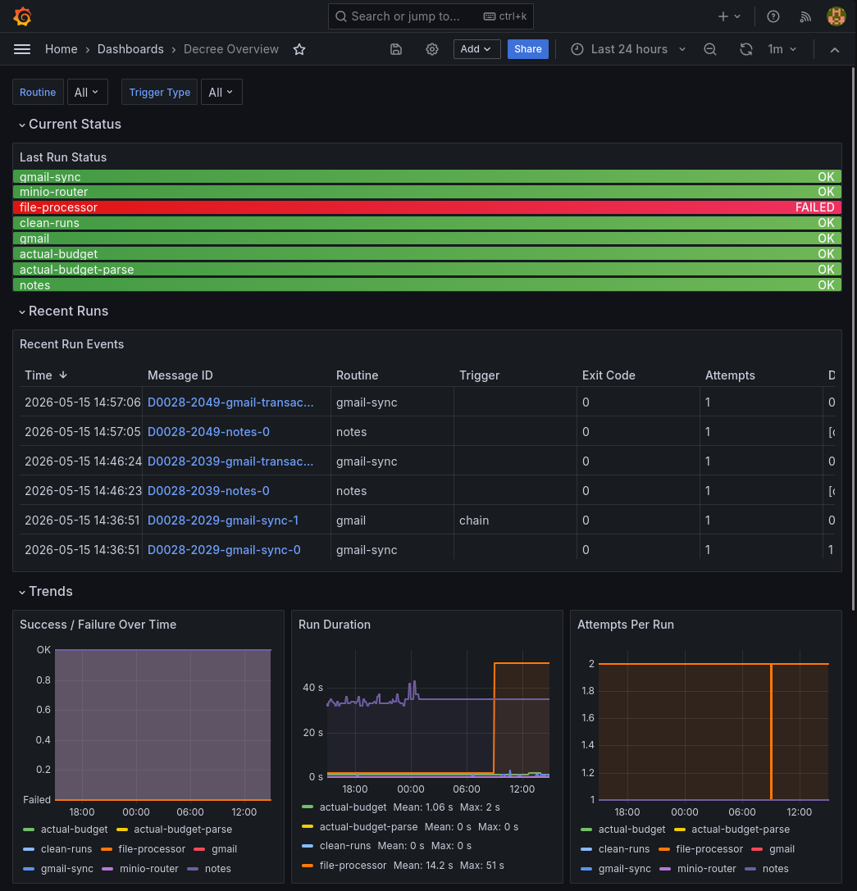

# Grafana

- Source: https://github.com/grafana/grafana
- License: [AGPL 3.0](https://www.gnu.org/licenses/agpl-3.0.html)
- UI: `https://grafana.<domain>`
- Credentials: `EXIST_USERNAME` / `EXIST_PASSWORD` (set via `.env.shared`)

Visualization layer for [Prometheus](./prometheus) metrics and [Loki](./loki) logs. Everything is provisioned from code — no manual setup needed.



## What's provisioned

| Resource | File | Purpose |
|---|---|---|
| Prometheus datasource | `provisioning/datasources/prometheus.yaml` | Default datasource, 15s scrape interval |
| Loki datasource | `provisioning/datasources/loki.yaml` | Log queries, max 1000 lines |
| Decree Overview dashboard | `provisioning/dashboards/decree-overview.json` | Pre-built Decree monitoring |
| Decree Run Detail dashboard | `provisioning/dashboards/decree-run-detail.json` | One run's `routine.log` and `message.md`, by message ID |

Grafana re-reads the dashboards directory every 30 seconds, so a dashboard JSON edit lands without a restart. Datasource provisioning is applied at startup only — restart grafana after editing a datasource YAML.

## Decree Overview dashboard

Covers the Decree automation engine, filterable by `routine` and `trigger_type` template
variables, with panels for:

- **Current Status** — last run success/failure per routine (Prometheus gauge)
- **Recent Run Events** — a table of every run (Loki), one row per attempt: message ID
  (linking to the Run Detail dashboard below), routine, **subroutine** (which specific
  file processor / department / etc. a routine dispatched to, when it says so — sparse by
  design), trigger, exit code, attempts, duration, and whether it was the final attempt
- **Trends** — success/failure, duration, and attempts-per-run over time (Prometheus,
  timeseries)
- **Logs** — a raw, filterable Loki log stream of routine output

This is the main place to check when a Decree automation fails or behaves unexpectedly.

## Extending

- **New dashboard**: drop a JSON export into `hosting/grafana/provisioning/dashboards/`. Grafana auto-loads it.
- **New datasource**: add a YAML file to `hosting/grafana/provisioning/datasources/`.
- **Alerts**: unified alerting only, configured in the Grafana UI — rules persist in the `grafana_data` volume. Legacy alert rules embedded in dashboard JSON were removed in Grafana 11. Alerting rules are not provisioned from files here; only `datasources/` and `dashboards/` are bind-mounted.

## Data flow summary

```
Decree run
  └─ afterEach.sh
       ├─ Pushgateway → Prometheus (metrics: success, duration, attempts)
       └─ Loki push API (log: structured summary line)

automation/runs/**/routine.log
  └─ Alloy → Loki (full routine output, labeled by message_id/chain/seq)

Grafana
  ├─ queries Prometheus for metric panels
  └─ queries Loki for log panels
```
