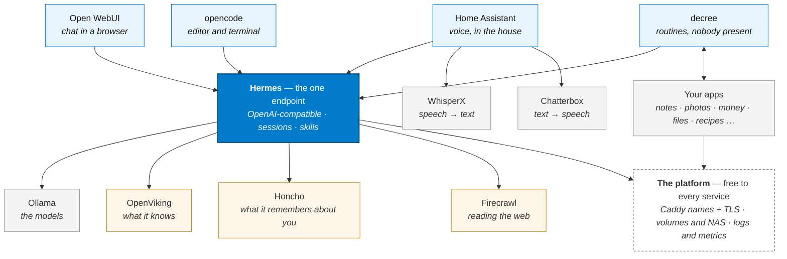

# The Pieces

:::info[Level 2 of 4 · Containers]
What is actually running, and how the parts fit together. Back out to
[Level 1 · What It Is](./intro), or zoom in to [Level 3 · Flows](./flows/) to follow one job
end to end.
:::

This is where the real names appear. Everything on this page is a replaceable choice — the
*shape* is the stable part, the projects filling each slot are not.

## The map



### Reading that in three lines

1. **Everything talks to Hermes.** Voice, browser, editor and automation all hit one
   OpenAI-compatible endpoint. Nothing else knows which model is loaded.
2. **decree is the hands.** It watches for things happening and runs routines against your
   apps and your data — calling Hermes when the work needs judgment.
3. **The platform is free to every service.** A name, a certificate, a place to put data and
   somewhere its logs go come with the folder; a service doesn't opt in.

## The AI spine, slot by slot

| Slot | Ships as | Why it's separate |
|---|---|---|
| **Gateway** | [Hermes](./ai/hermes) | One OpenAI-compatible URL and API key for every surface. Sessions, skills and memory live here, so they're shared rather than per-app. |
| **Models** | [Ollama](./ai/ollama) | Loads and serves the weights. Swapping model is a config change behind the gateway; no surface notices. |
| **Knowledge** | [OpenViking](./ai/openviking) | A `viking://` context database holding memory, resources and skills, so the agent has somewhere durable to keep what it knows rather than re-deriving it each session. |
| **Memory** | [Honcho](./ai/honcho) | Cross-session memory about *you*. Without it every conversation starts cold; with it, what it learned last week is still there. |
| **The web** | [Firecrawl](./ai/firecrawl) | Turns a URL into clean markdown a model can read, so no surface or routine has to carry its own browser automation. |
| **Speech → text** | [WhisperX](./ai/whisperx) | Transcription with speaker labels, used by both live voice and recording flows. |
| **Text → speech** | [Chatterbox](./ai/chatterbox) | The voice it answers in. Piper is the lighter alternative if you want it on a small box. |
| **Voice front end** | [Home Assistant](./services/homeassistant) | Wake word, microphones, speakers, and the ability to actually *do* something in the house. |
| **Chat front end** | [Open WebUI](./ai/open-web-ui) | Day-to-day conversation, pointed at Hermes rather than at a model. |
| **Coding front end** | [opencode](./ai/ollama#opencode-integration) | Configured with the Hermes URL as its OpenAI endpoint, so it shares the same models and skills. |
| **No-human surface** | [decree](./decree/) | The automation engine. Routines call the gateway exactly like you would. |

The reason for the gateway is the whole thesis in miniature: **figure the model, the key, the
skills and the memory out once, and four surfaces inherit it.** Without it you would configure
each one separately and they would drift.

## How it's assembled

The whole system, in one sentence:

> **You set a true/false flag per service. Everything enabled gets rendered and merged into
> one compose file and one env file, and runs on one shared network.**

That's it. There is no plugin system, no service registry, no orchestrator. If you understand
those three steps you understand the entire stack.

### 1. Choose — a flag per service

Every service is a folder, and every folder gets one flag in `.env.shared`:

```bash
EXIST_IS_<CATEGORY>_<SLUG>=true|false
```

The name is derived from the path, not declared anywhere: `ai/firecrawl` →
`EXIST_IS_AI_FIRECRAWL`, `services/code-server` → `EXIST_IS_SERVICES_CODE_SERVER`. Categories
are the top-level folders — `ai/`, `services/`, `nas/`, `hosting/`.

Disabled services are skipped entirely. No templates render, no secrets are generated, nothing
lands on disk.

### 2. Render — templates become live files

`./existential.sh` walks every enabled service and renders its `*.exist.*` templates into real
files, generating secrets as it goes (`EXIST_32_CHAR_HEX_KEY` and friends).

```
docker-compose.exist.yml   →  docker-compose.yml
.env.exist                 →  .env
config.exist.yml           →  config.yml
```

Templates are tracked in git; rendered files never are.

**Rendering happens once per file.** If the destination already exists it is left alone, so
the passwords you were prompted for and the edits you made afterwards survive every
subsequent run. `--force` re-renders anyway; a rendered `.env` is never overwritten even
then.

The exception is files that hold nothing you could lose — no secrets, no prompted answers.
Those are **regenerated on every run** so a value like `EXIST_DOMAIN` baked into them can't
go stale, and they carry a `DO NOT EDIT` header saying so. Dashy's `dashy-conf.yml` is the
one today: it bakes the domain because Dashy reads a static config file, and it re-renders
every run so changing your domain updates it along with everything else. If you'd rather
own it, flip `# EXIST_KEEP: false` to `true` in its header and the file is yours from then
on — never regenerated, `--force` included.

### 3. Merge — one compose file, one env file

Every enabled service's `docker-compose.yml` is merged into a single `docker-compose.yml` at
the repo root, and every service `.env` is merged into one master `.env` beside it. Relative
paths are rewritten so they resolve from the root.

```bash
docker compose up -d     # always from the repo root, never from a service folder
```

The generated root compose file is **always** overwritten — never edit it. Edit the service's
`docker-compose.exist.yml` and re-run `./existential.sh`.

## Adding a service is adding a folder

There is no list to register in. Create `<category>/<slug>/docker-compose.exist.yml`, add the
matching `EXIST_IS_*` flag, and it exists. The folder name *is* the service name — it becomes
the container prefix, the flag, and the hostname.

## One network

Everything enabled joins one Docker bridge network named `exist`, and reaches everything else
by container name:

```
http://ollama:11434     http://firecrawl:3002     http://decree-webhook:8801
```

No service discovery, no ports published to the host unless you ask. Browser access goes
through Caddy at `https://<slug>.<domain>`; container-to-container traffic uses the plain
hostname above — faster, and no TLS to trust.

## Hostnames that just work

`EXIST_DOMAIN` defaults to `<your-lan-ip-with-dashes>.nip.io`, derived automatically from the
IP you give during setup:

```
EXIST_LOCAL_HOST_IP=192.168.1.50
        ↓
EXIST_DOMAIN=192-168-1-50.nip.io      →  https://dashy.192-168-1-50.nip.io
```

[nip.io](https://nip.io) is public wildcard DNS: any name ending in `<ip>.nip.io` resolves
straight back to that IP. Nothing to register, nothing to configure. **Every phone and laptop
on your LAN can reach the stack immediately — no pihole, no `/etc/hosts`, no DNS setup.**

The catch: that lookup goes to the internet. If your WAN link is down, the names stop
resolving even on the host itself.

### Upgrading an existing install

Services now derive their hostname from `EXIST_DOMAIN` at container start
(`${CADDY_DOMAIN:-$EXIST_DOMAIN}`) rather than having it baked in when the template was
rendered, so changing `EXIST_DOMAIN` propagates on the next `docker compose up -d`.

That only applies to a *fresh* render. Rendered `.env` files are yours — the setup script
never overwrites them — so an install from before this change still carries the old baked
values, and they win over the new defaults. To pick up the change, delete these lines from
your rendered `.env` files if present:

| File | Delete |
|---|---|
| `hosting/caddy/.env` | `CADDY_DOMAIN=` |
| `services/mealie/.env` | `MEALIE_BASE_URL=` |
| `nas/collabora/.env` | `COLLABORA_DOMAIN=`, `COLLABORA_NEXTCLOUD_DOMAIN=` |

Set them again only if you deliberately want that service on a different domain from the
rest of the stack.

Rendered non-`.env` files are skipped the same way. If `hosting/caddy/Caddyfile` predates a
service you now have enabled, it has no site block for it — re-render with
`./existential.sh --force` (which re-prompts for placeholders) or copy the missing block
across from `Caddyfile.exist.Caddyfile` by hand.

### Two independent choices, not one upgrade path

There are two separate questions, and you can answer them in either order. Nothing forces
you to change both.

1. **How do names resolve?** → public DNS, or pihole
2. **Does the browser trust the cert?** → the stack's own CA, or a real certificate

|                    | **Internal CA** (trust once per device) | **Real certificate** (nothing to trust) |
|---|---|---|
| **nip.io** *(default)* | Zero setup. Needs internet for DNS. | Not possible — you don't control the `nip.io` zone. |
| **pihole** | Fully offline. Resolves locally. | **Fully offline *and* no warnings.** See below. |

The bottom-right cell is the good one, and it needs a domain you own — but **not** a public
A record, and **not** any inbound connectivity.

**Adding pihole is an upgrade, not a requirement.** Its single wildcard record answers the
same names locally, which removes the internet-DNS dependency. Nothing else changes, and
container-to-container traffic was never affected either way.

## Owned domain without exposing your network

The usual objection to a real certificate is that it means opening your network up. It
doesn't. **The DNS-01 challenge never requires an inbound connection.**

Let's Encrypt proves you own a domain by reading a `TXT` record from *public* DNS. Your
machine makes an **outbound** call to your DNS provider to create that record. Let's Encrypt
reads it from the DNS system — it never connects to you.

```
your host  ──outbound──▶  DNS provider API   (creates _acme-challenge TXT)
Let's Encrypt  ──reads──▶  public DNS         (never touches your network)

meanwhile:
pihole  ──▶  local.example.com  =  192.168.1.50   (resolution stays entirely on your LAN)
```

So you can have all of this at once:

- a **real, trusted certificate** — no warnings on any device, including phones
- **no public A record** — your LAN IP is never published
- **no port forwarding**, no inbound exposure of any kind
- **local DNS** via pihole, so name resolution works with the WAN unplugged

The only internet the setup needs is an outbound DNS API call at renewal time, roughly every
60 days.

### Setting it up

You need a domain and a DNS provider with an API. HTTP-01 will **not** work — it requires
Let's Encrypt to reach your server, which is exactly what you're avoiding.

**Option A — issue the cert elsewhere, drop it in.** Works with the stack as shipped:

```bash
# on any machine with internet, using your provider's DNS plugin
acme.sh --issue --dns dns_cf -d '*.local.example.com' -d local.example.com
```

Copy the result into `hosting/caddy/certs/` as `internal.pem` and `internal-key.pem`. Caddy's
`exist.initial.sh` skips minting whenever a leaf cert is already present, so it will use
yours untouched. Renew and re-copy every 90 days.

**Option B — let Caddy renew it automatically.** Caddy can do DNS-01 itself, but the stock
`caddy:2.11.4` image the stack ships contains **no DNS provider plugins** — you'd need a
custom image built with `xcaddy` including your provider's module, plus an API token in the
container. More moving parts, no manual renewals.

Then point `EXIST_DOMAIN` at your domain and add the pihole record:

```
EXIST_DOMAIN=local.example.com
address=/local.example.com/192.168.1.50     # pihole, resolves entirely on-LAN
```

:::note[Why not with nip.io or .internal]
`.internal` isn't a real domain, so no CA will ever issue for it. `nip.io` is real but not
yours — DNS-01 needs write access to the zone, and HTTP-01 needs a public IP. Either way the
internal CA is the only option there, which is why the default keeps it.
:::

## Core vs. complementary services

Not everything needs to be on that network. A service is **core** if it talks to other
services over the bridge. A service is **complementary** if it either talks over a normal URL
or protocol, or if nothing in the stack talks to it at all.

Complementary services can move to a different machine without changing how anything else
works. Today they still default to the `exist` network because it's simpler on one host — but
nothing about them depends on it.

| Service | Why it's complementary |
|---|---|
| **NAS** (Nextcloud, MinIO, Collabora, Redis) | The core stack reaches these over **rclone remotes and the S3 API** — a URL, not a container name. `redis` is used only by Nextcloud, inside the NAS group. |
| **Immich** | Nothing in the stack talks to it. It's a photo library that happens to be self-hosted alongside. |
| **Home Assistant** | Nothing in the stack talks to it either. It usually wants to live on whichever machine has your Zigbee/Z-Wave dongles plugged in. |
| **pi-hole** | LAN DNS. It serves your whole network, not the stack. No service calls it. |
| **Monitoring** (Grafana, Loki, Prometheus, Uptime-Kuma) | Scrapes and receives; nothing depends on it to function. |

The tell is simple: **if the connection is a URL you could point anywhere, the service is
complementary.** If it's a bare container name, it's core.

## Recommended deployment

Even on a single machine, it's worth thinking of this as three separate stacks. It costs
nothing now and means moving one of them later is a config change rather than a migration.

```
┌─ NAS stack ──────────────┐   Storage and files.
│  Nextcloud, MinIO,       │   Wants disks, not GPU.
│  Collabora, Redis        │   Reached over rclone / S3 URLs.
└──────────────────────────┘

┌─ Core stack ─────────────┐   The actual system.
│  decree, Hermes, Ollama, │   Wants CPU/GPU and RAM.
│  Caddy, OpenViking, …    │   One network, container-name DNS.
└──────────────────────────┘

┌─ Standalone ─────────────┐   Independent appliances.
│  Immich      pi-hole     │   Own lifecycle, own machine if you like.
│  Home Assistant          │   HA follows your USB radios.
└──────────────────────────┘
```

**Why split the NAS.** Storage and compute want different hardware and different reboot
schedules. Restarting Ollama to load a new model shouldn't interrupt file sync, and adding
disks shouldn't take the AI stack down. Because the core reaches storage through rclone and
S3, moving the NAS to its own box means changing an endpoint — not rewiring anything.

**Why pi-hole is separate.** It's your LAN's DNS server. It should stay up when you're
rebuilding the stack, which is exactly when you're most likely to break something.

**Why Home Assistant is separate.** It's usually pinned to physical hardware — a Zigbee or
Z-Wave stick in a USB port — so the machine it runs on is decided by where your radios are,
not by where your GPU is. It also runs your lights and locks, which you want working while
you rebuild everything else.

### Moving one to another machine

1. Set that service's `EXIST_IS_*` flag to `false` on the original host and re-run
   `./existential.sh`.
2. Bring the service up on the new host.
3. Update the endpoint that pointed at it — the rclone remote, the S3 URL, or the DNS record.

Nothing else changes. That is the entire point of the split.
